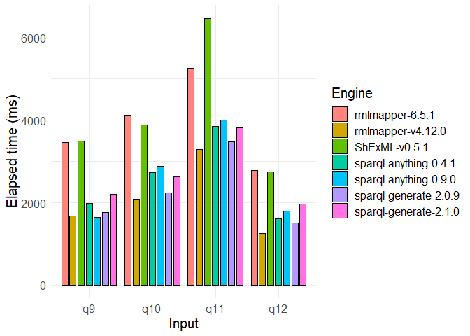
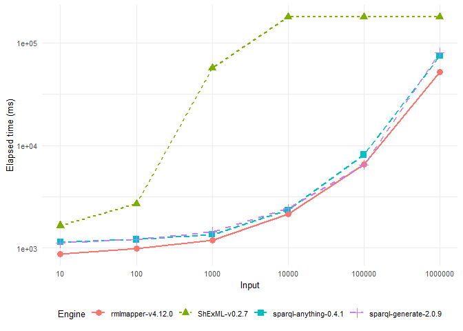
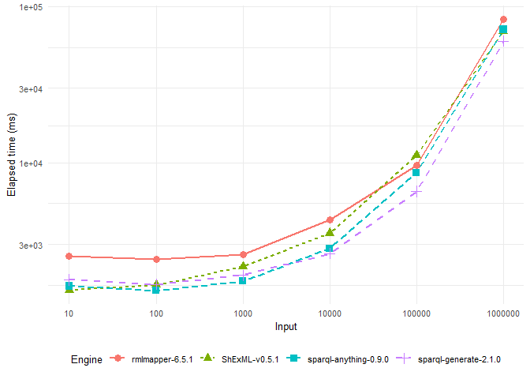

# Set up

``` r
different_inputs <- read.csv("C:/Users/Herminio/Git/shexml-performance-evaluation/sparql-anything-experiment/experiment/results/different_inputs.csv", sep=';')

increment_input <- read.csv("C:/Users/Herminio/Git/shexml-performance-evaluation/sparql-anything-experiment/experiment/results/increment_input.csv", sep=';')
```

# Plot different inputs

``` r
different_inputs[different_inputs$Engine != "ShExML-v0.2.7", ] %>%
    ggplot(aes(x=Input, y=Elapsed_time.ms., fill=Engine)) +
      geom_bar(stat="identity", position=position_dodge(0.9), width = 0.7, color="black") + 
      theme_minimal() + 
      scale_fill_hue(l=70, c=100) +
      ylab("Elapsed time (ms)") +
      scale_x_discrete(limits=c("q9", "q10", "q11", "q12")) + 
      theme(text = element_text(size=15))
```


\# Plot incremental input for old versions

``` r
increment_input$Input <- factor(increment_input$Input)
increment_input[(increment_input$Engine == "ShExML-v0.2.7" | increment_input$Engine == "sparql-anything-0.4.1" | increment_input$Engine == "rmlmapper-v4.12.0" | increment_input$Engine == "sparql-generate-2.0.9"), ] %>%
    ggplot(aes(x=Input, y=Elapsed_time.ms., group=Engine, color=Engine)) +
      geom_line(aes(linetype=Engine), size=1) + geom_point(aes(shape=Engine), size=3) +
      ylab("Elapsed time (ms)") +
      theme_minimal() + 
      scale_x_discrete(expand = c(0.04,0.04)) +
      theme(legend.position="bottom", text = element_text(size=15)) + 
      scale_y_log10()
```

    ## Warning: Using `size` aesthetic for lines was deprecated in ggplot2 3.4.0.
    ## ℹ Please use `linewidth` instead.
    ## This warning is displayed once every 8 hours.
    ## Call `lifecycle::last_lifecycle_warnings()` to see where this warning was
    ## generated.


\# Plot incremental input for new versions

``` r
increment_input$Input <- factor(increment_input$Input)
increment_input[(increment_input$Engine == "ShExML-v0.5.1" | increment_input$Engine == "sparql-anything-0.9.0" | increment_input$Engine == "rmlmapper-6.5.1" | increment_input$Engine == "sparql-generate-2.1.0"), ] %>%
    ggplot(aes(x=Input, y=Elapsed_time.ms., group=Engine, color=Engine)) +
      geom_line(aes(linetype=Engine), size=1) + geom_point(aes(shape=Engine), size=3) +
      ylab("Elapsed time (ms)") +
      theme_minimal() + 
      scale_x_discrete(expand = c(0.04,0.04)) +
      theme(legend.position="bottom", text = element_text(size=15)) + 
      scale_y_log10()
```


