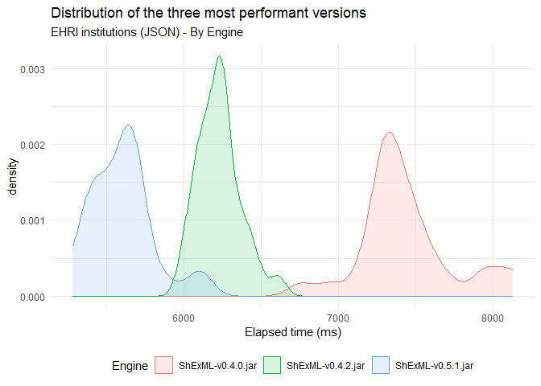

# Set up

``` r
datasetFull <- read.csv("C:/Users/Herminio/Git/shexml-performance-evaluation/statistics/results/resultEvaluationInstitutions.csv", sep=';')[, 2:3]
dataset <- datasetFull[(datasetFull$Engine == "ShExML-v0.3.3.jar" | datasetFull$Engine == "ShExML-v0.4.0.jar" | datasetFull$Engine == "ShExML-v0.4.2.jar" | datasetFull$Engine == "ShExML-v0.5.1.jar"), ]
```

# Descriptive statistics

``` r
stby(dataset, dataset$Engine, descr, round.digits=5, stats=c("mean", "med", "sd", "min", "max"))
```

    ## Descriptive Statistics  
    ## Elapsed_time.ms. by Engine  
    ## Data Frame: dataset  
    ## N: 30  
    ## 
    ##                 ShExML-v0.3.3.jar   ShExML-v0.4.0.jar   ShExML-v0.4.2.jar   ShExML-v0.5.1.jar
    ## ------------- ------------------- ------------------- ------------------- -------------------
    ##          Mean        157217.16667          7434.16667          6228.93333          5601.83333
    ##        Median        154946.00000          7376.50000          6230.50000          5623.00000
    ##       Std.Dev          5966.55622           302.49162           138.71279           197.05663
    ##           Min        149673.00000          6757.00000          5997.00000          5283.00000
    ##           Max        171430.00000          8132.00000          6611.00000          6124.00000

# Testing normality

``` r
by(dataset$Elapsed_time.ms., dataset$Engine, shapiro.test)
```

    ## dataset$Engine: ShExML-v0.3.3.jar
    ## 
    ##  Shapiro-Wilk normality test
    ## 
    ## data:  dd[x, ]
    ## W = 0.8987, p-value = 0.007806
    ## 
    ## ------------------------------------------------------------ 
    ## dataset$Engine: ShExML-v0.4.0.jar
    ## 
    ##  Shapiro-Wilk normality test
    ## 
    ## data:  dd[x, ]
    ## W = 0.92104, p-value = 0.02853
    ## 
    ## ------------------------------------------------------------ 
    ## dataset$Engine: ShExML-v0.4.2.jar
    ## 
    ##  Shapiro-Wilk normality test
    ## 
    ## data:  dd[x, ]
    ## W = 0.96396, p-value = 0.3893
    ## 
    ## ------------------------------------------------------------ 
    ## dataset$Engine: ShExML-v0.5.1.jar
    ## 
    ##  Shapiro-Wilk normality test
    ## 
    ## data:  dd[x, ]
    ## W = 0.93101, p-value = 0.05222

# Running Kruskal-Wallis

``` r
kruskal.test(Elapsed_time.ms. ~ Engine , data = dataset)
```

    ## 
    ##  Kruskal-Wallis rank sum test
    ## 
    ## data:  Elapsed_time.ms. by Engine
    ## Kruskal-Wallis chi-squared = 111.01, df = 3, p-value < 2.2e-16

# Post hoc test for Kruskal-Wallis

``` r
dunnTest(Elapsed_time.ms. ~ Engine , data = dataset, method = "bh")
```

    ## Warning: Engine was coerced to a factor.

    ## Dunn (1964) Kruskal-Wallis multiple comparison

    ##   p-values adjusted with the Benjamini-Hochberg method.

    ##                              Comparison        Z      P.unadj        P.adj
    ## 1 ShExML-v0.3.3.jar - ShExML-v0.4.0.jar 3.340219 8.371232e-04 1.004548e-03
    ## 2 ShExML-v0.3.3.jar - ShExML-v0.4.2.jar 6.723119 1.778755e-11 5.336265e-11
    ## 3 ShExML-v0.4.0.jar - ShExML-v0.4.2.jar 3.382900 7.172483e-04 1.075872e-03
    ## 4 ShExML-v0.3.3.jar - ShExML-v0.5.1.jar 9.977977 1.903078e-23 1.141847e-22
    ## 5 ShExML-v0.4.0.jar - ShExML-v0.5.1.jar 6.637758 3.184911e-11 6.369821e-11
    ## 6 ShExML-v0.4.2.jar - ShExML-v0.5.1.jar 3.254858 1.134491e-03 1.134491e-03

# Effect size

``` r
post_hoc_results <- dunn_test(Elapsed_time.ms. ~ Engine , data = dataset, p.adjust.method = "BH")
post_hoc_results$r <- post_hoc_results$statistic / sqrt(post_hoc_results$n1+post_hoc_results$n2)
post_hoc_results[, c(1,2,3,10)]
```

    ## # A tibble: 6 × 4
    ##   .y.              group1            group2                 r
    ##   <chr>            <chr>             <chr>              <dbl>
    ## 1 Elapsed_time.ms. ShExML-v0.3.3.jar ShExML-v0.4.0.jar -0.431
    ## 2 Elapsed_time.ms. ShExML-v0.3.3.jar ShExML-v0.4.2.jar -0.868
    ## 3 Elapsed_time.ms. ShExML-v0.3.3.jar ShExML-v0.5.1.jar -1.29 
    ## 4 Elapsed_time.ms. ShExML-v0.4.0.jar ShExML-v0.4.2.jar -0.437
    ## 5 Elapsed_time.ms. ShExML-v0.4.0.jar ShExML-v0.5.1.jar -0.857
    ## 6 Elapsed_time.ms. ShExML-v0.4.2.jar ShExML-v0.5.1.jar -0.420

# Plot

``` r
dataset[(dataset$Engine == "ShExML-v0.4.0.jar" | dataset$Engine == "ShExML-v0.4.2.jar" | dataset$Engine == "ShExML-v0.5.1.jar"), ]  %>%
    ggplot(aes(fill=Engine, y=Elapsed_time.ms., x=Engine)) +
        geom_boxplot(
            # Notch?
            notch=TRUE,
            notchwidth = 0.8,
            
            # custom outliers
            outlier.colour="red",
            outlier.fill="red",
            outlier.size=3
        )
```

    ## Notch went outside hinges
    ## ℹ Do you want `notch = FALSE`?


``` r
dataset[(dataset$Engine == "ShExML-v0.4.0.jar" | dataset$Engine == "ShExML-v0.4.2.jar" | dataset$Engine == "ShExML-v0.5.1.jar"), ] %>%
  ggplot(aes(fill=Engine, color=Engine, x=Elapsed_time.ms.)) +
  geom_density(alpha = 0.15) +
  theme_minimal() + 
  ggtitle("Distribution of the three most performant versions", "By Engine")
```


