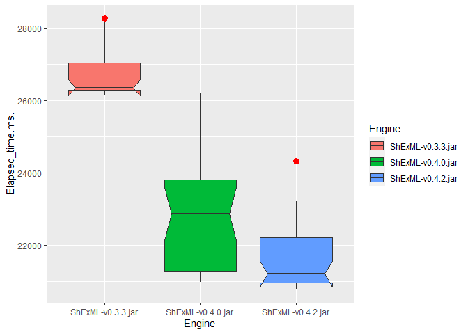
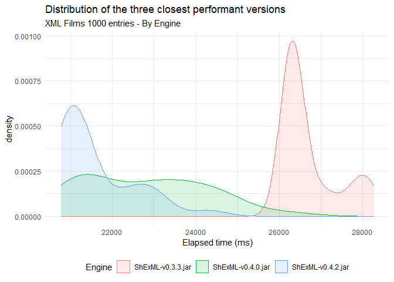

# Set up

``` r
dataset <- read.csv("C:/Users/Herminio/Git/shexml-performance-evaluation/statistics/results/resultEvaluationXML.csv", sep=';')[, 2:3]
```

# Descriptive statistics

``` r
stby(dataset, dataset$Engine, descr, round.digits=5, stats=c("mean", "med", "sd", "min", "max"))
```

    ## Descriptive Statistics  
    ## Elapsed_time.ms. by Engine  
    ## Data Frame: dataset  
    ## N: 30  
    ## 
    ##                 ShExML-v0.3.2.jar   ShExML-v0.3.3.jar   ShExML-v0.4.0.jar   ShExML-v0.4.2.jar
    ## ------------- ------------------- ------------------- ------------------- -------------------
    ##          Mean        107352.33333         26724.26667         22787.36667         21596.10000
    ##        Median        106644.50000         26358.00000         22858.00000         21195.00000
    ##       Std.Dev          5239.70542           690.67777          1463.50730           906.07613
    ##           Min        100762.00000         26144.00000         20980.00000         20770.00000
    ##           Max        117625.00000         28271.00000         26207.00000         24324.00000
    ## 
    ## Table: Table continues below
    ## 
    ##  
    ## 
    ##                 ShExML-v0.5.1.jar
    ## ------------- -------------------
    ##          Mean          4867.26667
    ##        Median          4825.50000
    ##       Std.Dev           244.74800
    ##           Min          4663.00000
    ##           Max          5953.00000

# Testing normality

``` r
by(dataset$Elapsed_time.ms., dataset$Engine, shapiro.test)
```

    ## dataset$Engine: ShExML-v0.3.2.jar
    ## 
    ##  Shapiro-Wilk normality test
    ## 
    ## data:  dd[x, ]
    ## W = 0.92148, p-value = 0.0293
    ## 
    ## ------------------------------------------------------------ 
    ## dataset$Engine: ShExML-v0.3.3.jar
    ## 
    ##  Shapiro-Wilk normality test
    ## 
    ## data:  dd[x, ]
    ## W = 0.74875, p-value = 8.694e-06
    ## 
    ## ------------------------------------------------------------ 
    ## dataset$Engine: ShExML-v0.4.0.jar
    ## 
    ##  Shapiro-Wilk normality test
    ## 
    ## data:  dd[x, ]
    ## W = 0.928, p-value = 0.04345
    ## 
    ## ------------------------------------------------------------ 
    ## dataset$Engine: ShExML-v0.4.2.jar
    ## 
    ##  Shapiro-Wilk normality test
    ## 
    ## data:  dd[x, ]
    ## W = 0.79397, p-value = 5.1e-05
    ## 
    ## ------------------------------------------------------------ 
    ## dataset$Engine: ShExML-v0.5.1.jar
    ## 
    ##  Shapiro-Wilk normality test
    ## 
    ## data:  dd[x, ]
    ## W = 0.65113, p-value = 3.266e-07

# Running Kruskal-Wallis

``` r
kruskal.test(Elapsed_time.ms. ~ Engine , data = dataset)
```

    ## 
    ##  Kruskal-Wallis rank sum test
    ## 
    ## data:  Elapsed_time.ms. by Engine
    ## Kruskal-Wallis chi-squared = 137.79, df = 4, p-value < 2.2e-16

# Post hoc test for Kruskal-Wallis

``` r
dunnTest(Elapsed_time.ms. ~ Engine , data = dataset, method = "bh")
```

    ## Warning: Engine was coerced to a factor.

    ## Dunn (1964) Kruskal-Wallis multiple comparison

    ##   p-values adjusted with the Benjamini-Hochberg method.

    ##                               Comparison         Z      P.unadj        P.adj
    ## 1  ShExML-v0.3.2.jar - ShExML-v0.3.3.jar  2.686270 7.225461e-03 8.028290e-03
    ## 2  ShExML-v0.3.2.jar - ShExML-v0.4.0.jar  5.957934 2.554473e-09 6.386182e-09
    ## 3  ShExML-v0.3.3.jar - ShExML-v0.4.0.jar  3.271663 1.069168e-03 1.336460e-03
    ## 4  ShExML-v0.3.2.jar - ShExML-v0.4.2.jar  7.402101 1.340465e-13 4.468215e-13
    ## 5  ShExML-v0.3.3.jar - ShExML-v0.4.2.jar  4.715831 2.407265e-06 4.012109e-06
    ## 6  ShExML-v0.4.0.jar - ShExML-v0.4.2.jar  1.444167 1.486919e-01 1.486919e-01
    ## 7  ShExML-v0.3.2.jar - ShExML-v0.5.1.jar 10.697537 1.045199e-26 1.045199e-25
    ## 8  ShExML-v0.3.3.jar - ShExML-v0.5.1.jar  8.011266 1.135333e-15 5.676665e-15
    ## 9  ShExML-v0.4.0.jar - ShExML-v0.5.1.jar  4.739603 2.141373e-06 4.282747e-06
    ## 10 ShExML-v0.4.2.jar - ShExML-v0.5.1.jar  3.295436 9.826923e-04 1.403846e-03

# Effect size

``` r
post_hoc_results <- dunn_test(Elapsed_time.ms. ~ Engine , data = dataset, p.adjust.method = "BH")
post_hoc_results$r <- post_hoc_results$statistic / sqrt(post_hoc_results$n1+post_hoc_results$n2)
post_hoc_results[, c(1,2,3,10)]
```

    ## # A tibble: 10 × 4
    ##    .y.              group1            group2                 r
    ##    <chr>            <chr>             <chr>              <dbl>
    ##  1 Elapsed_time.ms. ShExML-v0.3.2.jar ShExML-v0.3.3.jar -0.347
    ##  2 Elapsed_time.ms. ShExML-v0.3.2.jar ShExML-v0.4.0.jar -0.769
    ##  3 Elapsed_time.ms. ShExML-v0.3.2.jar ShExML-v0.4.2.jar -0.956
    ##  4 Elapsed_time.ms. ShExML-v0.3.2.jar ShExML-v0.5.1.jar -1.38 
    ##  5 Elapsed_time.ms. ShExML-v0.3.3.jar ShExML-v0.4.0.jar -0.422
    ##  6 Elapsed_time.ms. ShExML-v0.3.3.jar ShExML-v0.4.2.jar -0.609
    ##  7 Elapsed_time.ms. ShExML-v0.3.3.jar ShExML-v0.5.1.jar -1.03 
    ##  8 Elapsed_time.ms. ShExML-v0.4.0.jar ShExML-v0.4.2.jar -0.186
    ##  9 Elapsed_time.ms. ShExML-v0.4.0.jar ShExML-v0.5.1.jar -0.612
    ## 10 Elapsed_time.ms. ShExML-v0.4.2.jar ShExML-v0.5.1.jar -0.425

# Plot

``` r
dataset[(dataset$Engine == "ShExML-v0.3.3.jar" | dataset$Engine == "ShExML-v0.4.0.jar" | dataset$Engine == "ShExML-v0.4.2.jar"), ]  %>%
    ggplot(aes(fill=Engine, y=Elapsed_time.ms., x=Engine)) +
        geom_boxplot(
            # Notch?
            notch=TRUE,
            notchwidth = 0.8,
            
            # custom outliers
            outlier.colour="red",
            outlier.fill="red",
            outlier.size=3
        )
```

    ## Notch went outside hinges
    ## ℹ Do you want `notch = FALSE`?
    ## Notch went outside hinges
    ## ℹ Do you want `notch = FALSE`?



``` r
dataset[(dataset$Engine == "ShExML-v0.3.3.jar" | dataset$Engine == "ShExML-v0.4.0.jar" | dataset$Engine == "ShExML-v0.4.2.jar"), ]  %>%
  ggplot(aes(fill=Engine, color=Engine, x=Elapsed_time.ms.)) +
  geom_density(alpha = 0.15) +
  xlab("Elapsed time (ms)") +
  theme_minimal() + 
  theme(legend.position="bottom") +
  ggtitle("Distribution of the three closest performant versions", "XML Films 1000 entries - By Engine")
```


