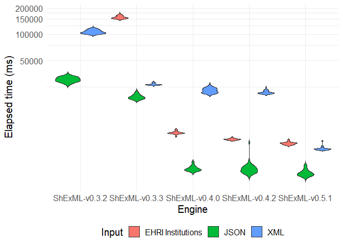

# Set up

``` r
datasetXML <- read.csv("C:/Users/Herminio/Git/shexml-performance-evaluation/statistics/results/resultEvaluationXML.csv", sep=';')[, 2:3]
datasetXML$Input <- "XML"

datasetJSON <- read.csv("C:/Users/Herminio/Git/shexml-performance-evaluation/statistics/results/resultEvaluationJSON.csv", sep=';')[, 2:3]
datasetJSON$Input <- "JSON"

datasetInstitutionsFull <- read.csv("C:/Users/Herminio/Git/shexml-performance-evaluation/statistics/results/resultEvaluationInstitutions.csv", sep=';')[, 2:3]
datasetInstitutions <- datasetInstitutionsFull[(datasetInstitutionsFull$Engine == "ShExML-v0.3.3.jar" | datasetInstitutionsFull$Engine == "ShExML-v0.4.0.jar" | datasetInstitutionsFull$Engine == "ShExML-v0.4.2.jar" | datasetInstitutionsFull$Engine == "ShExML-v0.5.1.jar"), ]
datasetInstitutions$Input <- "EHRI Institutions"

dataset <- rbind(datasetXML, datasetJSON, datasetInstitutions)
```

# Plot

``` r
dataset[dataset$Engine=="ShExML-v0.3.2.jar", "Engine"] <- "ShExML-v0.3.2"
dataset[dataset$Engine=="ShExML-v0.3.3.jar", "Engine"] <- "ShExML-v0.3.3"
dataset[dataset$Engine=="ShExML-v0.4.0.jar", "Engine"] <- "ShExML-v0.4.0"
dataset[dataset$Engine=="ShExML-v0.4.2.jar", "Engine"] <- "ShExML-v0.4.2"
dataset[dataset$Engine=="ShExML-v0.5.1.jar", "Engine"] <- "ShExML-v0.5.1"

dataset %>%
    ggplot(aes(fill=Input, y=Elapsed_time.ms., x=Engine)) +
        geom_violin(trim=FALSE, scale="width") + 
        coord_trans(y="log10") +
        theme_minimal() + 
        ylab("Elapsed time (ms)") +
        theme(legend.position="bottom", text = element_text(size=15))
```


