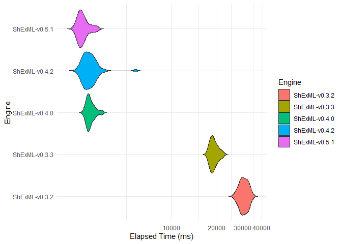
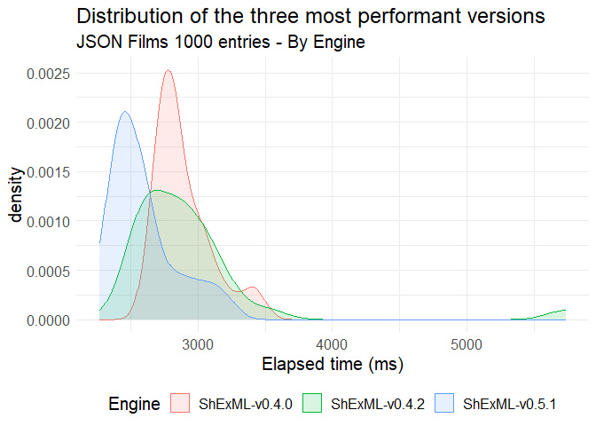

# Set up

``` r
dataset <- read.csv("C:/Users/Herminio/Git/shexml-performance-evaluation/statistics/results/resultEvaluationJSON.csv", sep=';')[, 2:3]
```

# Descriptive statistics

``` r
stby(dataset, dataset$Engine, descr, round.digits=5, stats=c("mean", "med", "sd", "min", "max"))
```

    ## Descriptive Statistics  
    ## Elapsed_time.ms. by Engine  
    ## Data Frame: dataset  
    ## N: 30  
    ## 
    ##                 ShExML-v0.3.2.jar   ShExML-v0.3.3.jar   ShExML-v0.4.0.jar   ShExML-v0.4.2.jar
    ## ------------- ------------------- ------------------- ------------------- -------------------
    ##          Mean         30488.20000         19220.23333          2888.56667          2935.83333
    ##        Median         30572.00000         18984.50000          2823.00000          2843.00000
    ##       Std.Dev          2015.11590          1190.45815           202.72721           583.90600
    ##           Min         26696.00000         17780.00000          2670.00000          2496.00000
    ##           Max         34699.00000         22109.00000          3418.00000          5740.00000
    ## 
    ## Table: Table continues below
    ## 
    ##  
    ## 
    ##                 ShExML-v0.5.1.jar
    ## ------------- -------------------
    ##          Mean          2591.50000
    ##        Median          2527.00000
    ##       Std.Dev           242.94894
    ##           Min          2271.00000
    ##           Max          3220.00000

# Testing normality

``` r
by(dataset$Elapsed_time.ms., dataset$Engine, shapiro.test)
```

    ## dataset$Engine: ShExML-v0.3.2.jar
    ## 
    ##  Shapiro-Wilk normality test
    ## 
    ## data:  dd[x, ]
    ## W = 0.98032, p-value = 0.834
    ## 
    ## ------------------------------------------------------------ 
    ## dataset$Engine: ShExML-v0.3.3.jar
    ## 
    ##  Shapiro-Wilk normality test
    ## 
    ## data:  dd[x, ]
    ## W = 0.92065, p-value = 0.02789
    ## 
    ## ------------------------------------------------------------ 
    ## dataset$Engine: ShExML-v0.4.0.jar
    ## 
    ##  Shapiro-Wilk normality test
    ## 
    ## data:  dd[x, ]
    ## W = 0.84958, p-value = 0.0006076
    ## 
    ## ------------------------------------------------------------ 
    ## dataset$Engine: ShExML-v0.4.2.jar
    ## 
    ##  Shapiro-Wilk normality test
    ## 
    ## data:  dd[x, ]
    ## W = 0.55807, p-value = 2.331e-08
    ## 
    ## ------------------------------------------------------------ 
    ## dataset$Engine: ShExML-v0.5.1.jar
    ## 
    ##  Shapiro-Wilk normality test
    ## 
    ## data:  dd[x, ]
    ## W = 0.87807, p-value = 0.002547

# Running Kruskal-Wallis

``` r
kruskal.test(Elapsed_time.ms. ~ Engine , data = dataset)
```

    ## 
    ##  Kruskal-Wallis rank sum test
    ## 
    ## data:  Elapsed_time.ms. by Engine
    ## Kruskal-Wallis chi-squared = 123.41, df = 4, p-value < 2.2e-16

# Post hoc test for Kruskal-Wallis

``` r
dunnTest(Elapsed_time.ms. ~ Engine , data = dataset, method = "bh")
```

    ## Warning: Engine was coerced to a factor.

    ## Dunn (1964) Kruskal-Wallis multiple comparison

    ##   p-values adjusted with the Benjamini-Hochberg method.

    ##                               Comparison         Z      P.unadj        P.adj
    ## 1  ShExML-v0.3.2.jar - ShExML-v0.3.3.jar 2.6743937 7.486451e-03 9.358064e-03
    ## 2  ShExML-v0.3.2.jar - ShExML-v0.4.0.jar 6.9697670 3.174662e-12 7.936656e-12
    ## 3  ShExML-v0.3.3.jar - ShExML-v0.4.0.jar 4.2953734 1.743996e-05 2.906659e-05
    ## 4  ShExML-v0.3.2.jar - ShExML-v0.4.2.jar 7.3620114 1.811594e-13 9.057972e-13
    ## 5  ShExML-v0.3.3.jar - ShExML-v0.4.2.jar 4.6876178 2.764036e-06 5.528073e-06
    ## 6  ShExML-v0.4.0.jar - ShExML-v0.4.2.jar 0.3922444 6.948776e-01 6.948776e-01
    ## 7  ShExML-v0.3.2.jar - ShExML-v0.5.1.jar 9.7377645 2.080814e-22 2.080814e-21
    ## 8  ShExML-v0.3.3.jar - ShExML-v0.5.1.jar 7.0633708 1.625113e-12 5.417043e-12
    ## 9  ShExML-v0.4.0.jar - ShExML-v0.5.1.jar 2.7679974 5.640190e-03 8.057414e-03
    ## 10 ShExML-v0.4.2.jar - ShExML-v0.5.1.jar 2.3757530 1.751318e-02 1.945909e-02

# Effect size

``` r
post_hoc_results <- dunn_test(Elapsed_time.ms. ~ Engine , data = dataset, p.adjust.method = "BH")
post_hoc_results$r <- post_hoc_results$statistic / sqrt(post_hoc_results$n1+post_hoc_results$n2)
post_hoc_results[, c(1,2,3,10)]
```

    ## # A tibble: 10 × 4
    ##    .y.              group1            group2                  r
    ##    <chr>            <chr>             <chr>               <dbl>
    ##  1 Elapsed_time.ms. ShExML-v0.3.2.jar ShExML-v0.3.3.jar -0.345 
    ##  2 Elapsed_time.ms. ShExML-v0.3.2.jar ShExML-v0.4.0.jar -0.900 
    ##  3 Elapsed_time.ms. ShExML-v0.3.2.jar ShExML-v0.4.2.jar -0.950 
    ##  4 Elapsed_time.ms. ShExML-v0.3.2.jar ShExML-v0.5.1.jar -1.26  
    ##  5 Elapsed_time.ms. ShExML-v0.3.3.jar ShExML-v0.4.0.jar -0.555 
    ##  6 Elapsed_time.ms. ShExML-v0.3.3.jar ShExML-v0.4.2.jar -0.605 
    ##  7 Elapsed_time.ms. ShExML-v0.3.3.jar ShExML-v0.5.1.jar -0.912 
    ##  8 Elapsed_time.ms. ShExML-v0.4.0.jar ShExML-v0.4.2.jar -0.0506
    ##  9 Elapsed_time.ms. ShExML-v0.4.0.jar ShExML-v0.5.1.jar -0.357 
    ## 10 Elapsed_time.ms. ShExML-v0.4.2.jar ShExML-v0.5.1.jar -0.307

# Plot

``` r
dataset[dataset$Engine=="ShExML-v0.3.2.jar", "Engine"] <- "ShExML-v0.3.2"
dataset[dataset$Engine=="ShExML-v0.3.3.jar", "Engine"] <- "ShExML-v0.3.3"
dataset[dataset$Engine=="ShExML-v0.4.0.jar", "Engine"] <- "ShExML-v0.4.0"
dataset[dataset$Engine=="ShExML-v0.4.2.jar", "Engine"] <- "ShExML-v0.4.2"
dataset[dataset$Engine=="ShExML-v0.5.1.jar", "Engine"] <- "ShExML-v0.5.1"

dataset %>%
    ggplot(aes(fill=Engine, x=Elapsed_time.ms., y=Engine)) +
        geom_violin(trim=FALSE, scale="width") +
        xlab("Elapsed Time (ms)") +
        theme_minimal() + 
        coord_trans(x="log10")
```



``` r
dataset[(dataset$Engine == "ShExML-v0.4.0" | dataset$Engine == "ShExML-v0.4.2" | dataset$Engine == "ShExML-v0.5.1"), ] %>%
  ggplot(aes(fill=Engine, color=Engine, x=Elapsed_time.ms.)) +
  geom_density(alpha = 0.15) +
  xlab("Elapsed time (ms)") +
  theme_minimal() +
  theme(legend.position="bottom", text = element_text(size=15)) +
  ggtitle("Distribution of the three most performant versions", "JSON Films 1000 entries - By Engine")
```


