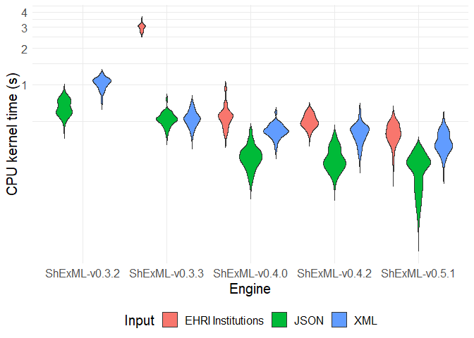
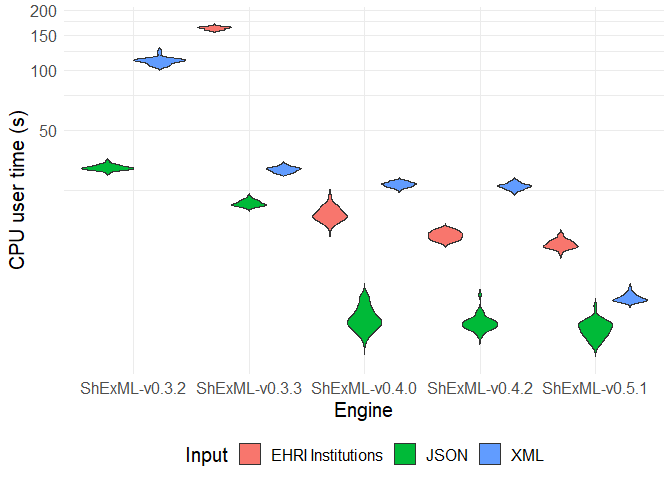
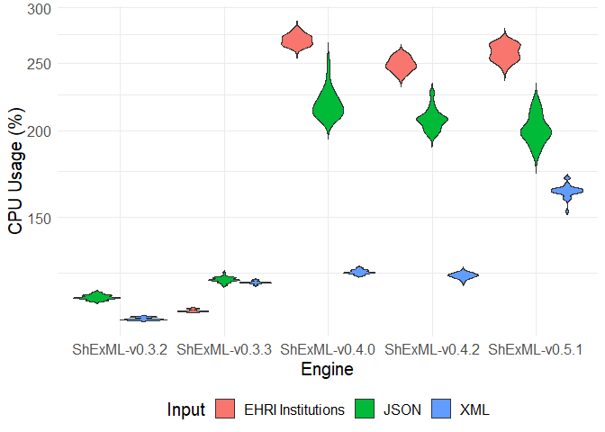
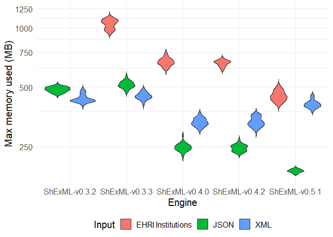

# Set up

``` r
datasetJSON <- read.csv("C:/Users/Herminio/Git/shexml-performance-evaluation/statistics/results/resultEvaluationRAMAndCPUForJSON.csv", sep=';')[, 2:7]
datasetJSON$Input <- "JSON"
datasetJSON$CPU_Percentage=as.numeric(sub("%","", datasetJSON$CPU_Percentage))

datasetXML <- read.csv("C:/Users/Herminio/Git/shexml-performance-evaluation/statistics/results/resultEvaluationRAMAndCPUForXML.csv", sep=';')[, 2:7]
datasetXML$Input <- "XML"
datasetXML$CPU_Percentage=as.numeric(sub("%","", datasetXML$CPU_Percentage))

datasetInstitutions <- read.csv("C:/Users/Herminio/Git/shexml-performance-evaluation/statistics/results/resultEvaluationRAMAndCPUForInstitutions.csv", sep=';')[, 2:7]
datasetInstitutions$Input <- "EHRI Institutions"
datasetInstitutions$CPU_Percentage=as.numeric(sub("%","", datasetInstitutions$CPU_Percentage))
```

# Descriptive statistics

``` r
stby(datasetJSON, datasetJSON$Engine, descr, round.digits=5, stats=c("mean", "med", "sd", "min", "max"))
```

    ## Non-numerical variable(s) ignored: Engine, Input

    ## Descriptive Statistics  
    ## datasetJSON  
    ## Group: Engine = ShExML-v0.3.2  
    ## N: 30  
    ## 
    ##                 CPU_kernel.s.   CPU_Percentage   CPU_user.s.   Elapsed_time.s.   MaxMemory.Kbytes.
    ## ------------- --------------- ---------------- ------------- ----------------- -------------------
    ##          Mean         0.66933        115.26667      32.46033          28.59767        499383.60000
    ##        Median         0.67500        115.00000      32.36000          28.53000        499742.00000
    ##       Std.Dev         0.09801          0.90719       0.95310           0.78832         15019.11828
    ##           Min         0.49000        114.00000      30.48000          26.83000        470328.00000
    ##           Max         0.88000        117.00000      35.03000          30.94000        526156.00000
    ## 
    ## Group: Engine = ShExML-v0.3.3  
    ## N: 30  
    ## 
    ##                 CPU_kernel.s.   CPU_Percentage   CPU_user.s.   Elapsed_time.s.   MaxMemory.Kbytes.
    ## ------------- --------------- ---------------- ------------- ----------------- -------------------
    ##          Mean         0.52833        122.16667      21.49000          17.96633        529061.33333
    ##        Median         0.52000        122.00000      21.29000          17.90500        524394.00000
    ##       Std.Dev         0.06884          1.08543       0.70155           0.58878         21785.55926
    ##           Min         0.39000        120.00000      20.35000          17.00000        487264.00000
    ##           Max         0.76000        125.00000      23.26000          19.70000        584120.00000
    ## 
    ## Group: Engine = ShExML-v0.4.0  
    ## N: 30  
    ## 
    ##                 CPU_kernel.s.   CPU_Percentage   CPU_user.s.   Elapsed_time.s.   MaxMemory.Kbytes.
    ## ------------- --------------- ---------------- ------------- ----------------- -------------------
    ##          Mean         0.26767        219.30000       5.80333           2.75833        254791.86667
    ##        Median         0.26000        217.00000       5.61500           2.68500        253972.00000
    ##       Std.Dev         0.05888         10.87278       0.76290           0.29332         11966.66950
    ##           Min         0.17000        208.00000       4.71000           2.31000        229668.00000
    ##           Max         0.42000        253.00000       7.48000           3.40000        291692.00000
    ## 
    ## Group: Engine = ShExML-v0.4.2  
    ## N: 30  
    ## 
    ##                 CPU_kernel.s.   CPU_Percentage   CPU_user.s.   Elapsed_time.s.   MaxMemory.Kbytes.
    ## ------------- --------------- ---------------- ------------- ----------------- -------------------
    ##          Mean         0.25767        207.86667       5.45033           2.73767        252594.66667
    ##        Median         0.24000        207.00000       5.36000           2.71000        253438.00000
    ##       Std.Dev         0.05643          7.54176       0.53050           0.20522          9881.96347
    ##           Min         0.18000        196.00000       4.67000           2.46000        236272.00000
    ##           Max         0.39000        227.00000       7.49000           3.40000        277340.00000
    ## 
    ## Group: Engine = ShExML-v0.5.1  
    ## N: 30  
    ## 
    ##                 CPU_kernel.s.   CPU_Percentage   CPU_user.s.   Elapsed_time.s.   MaxMemory.Kbytes.
    ## ------------- --------------- ---------------- ------------- ----------------- -------------------
    ##          Mean         0.21767        201.70000       5.08900           2.62367        192980.93333
    ##        Median         0.22500        199.50000       5.06000           2.60500        192632.00000
    ##       Std.Dev         0.05667          9.42539       0.50569           0.21203          3794.64765
    ##           Min         0.10000        186.00000       4.23000           2.21000        185368.00000
    ##           Max         0.31000        221.00000       6.54000           3.10000        200164.00000

``` r
stby(datasetXML, datasetXML$Engine, descr, round.digits=5, stats=c("mean", "med", "sd", "min", "max"))
```

    ## Non-numerical variable(s) ignored: Engine, Input

    ## Descriptive Statistics  
    ## datasetXML  
    ## Group: Engine = ShExML-v0.3.2  
    ## N: 30  
    ## 
    ##                 CPU_kernel.s.   CPU_Percentage   CPU_user.s.   Elapsed_time.s.   MaxMemory.Kbytes.
    ## ------------- --------------- ---------------- ------------- ----------------- -------------------
    ##          Mean         1.04233        107.36667     111.59133         104.37033        449475.06667
    ##        Median         1.05500        107.00000     111.78500         104.52000        440568.00000
    ##       Std.Dev         0.11013          0.49013       4.65845           4.30542         21540.67984
    ##           Min         0.74000        107.00000     103.99000          97.16000        415636.00000
    ##           Max         1.23000        108.00000     125.72000         117.18000        502536.00000
    ## 
    ## Group: Engine = ShExML-v0.3.3  
    ## N: 30  
    ## 
    ##                 CPU_kernel.s.   CPU_Percentage   CPU_user.s.   Elapsed_time.s.   MaxMemory.Kbytes.
    ## ------------- --------------- ---------------- ------------- ----------------- -------------------
    ##          Mean         0.53667        121.06667      31.78433          26.58600        463119.20000
    ##        Median         0.53000        121.00000      31.86500          26.63000        461158.00000
    ##       Std.Dev         0.07712          0.52083       0.93517           0.75828         18609.17452
    ##           Min         0.39000        120.00000      30.27000          25.36000        419384.00000
    ##           Max         0.72000        122.00000      33.73000          28.24000        502620.00000
    ## 
    ## Group: Engine = ShExML-v0.4.0  
    ## N: 30  
    ## 
    ##                 CPU_kernel.s.   CPU_Percentage   CPU_user.s.   Elapsed_time.s.   MaxMemory.Kbytes.
    ## ------------- --------------- ---------------- ------------- ----------------- -------------------
    ##          Mean         0.42267        125.30000      26.74133          21.59900        341774.80000
    ##        Median         0.42000        125.00000      26.87500          21.71500        339024.00000
    ##       Std.Dev         0.05552          0.87691       0.75558           0.60096         15982.38534
    ##           Min         0.30000        124.00000      25.07000          20.34000        313932.00000
    ##           Max         0.59000        127.00000      27.95000          22.66000        376128.00000
    ## 
    ## Group: Engine = ShExML-v0.4.2  
    ## N: 30  
    ## 
    ##                 CPU_kernel.s.   CPU_Percentage   CPU_user.s.   Elapsed_time.s.   MaxMemory.Kbytes.
    ## ------------- --------------- ---------------- ------------- ----------------- -------------------
    ##          Mean         0.41333        123.83333      26.19167          21.39900        343694.26667
    ##        Median         0.41500        124.00000      26.17000          21.36000        337638.00000
    ##       Std.Dev         0.07341          1.08543       0.91638           0.73450         18843.19582
    ##           Min         0.27000        121.00000      24.21000          19.69000        309764.00000
    ##           Max         0.62000        126.00000      28.22000          23.04000        375540.00000
    ## 
    ## Group: Engine = ShExML-v0.5.1  
    ## N: 30  
    ## 
    ##                 CPU_kernel.s.   CPU_Percentage   CPU_user.s.   Elapsed_time.s.   MaxMemory.Kbytes.
    ## ------------- --------------- ---------------- ------------- ----------------- -------------------
    ##          Mean         0.35167        163.80000       7.19900           4.60033        421860.53333
    ##        Median         0.33500        164.00000       7.09500           4.54500        418216.00000
    ##       Std.Dev         0.06608          3.37741       0.31453           0.24088         19650.89765
    ##           Min         0.24000        153.00000       6.80000           4.33000        387988.00000
    ##           Max         0.51000        171.00000       8.13000           5.38000        469364.00000

``` r
stby(datasetInstitutions, datasetInstitutions$Engine, descr, round.digits=5, stats=c("mean", "med", "sd", "min", "max"))
```

    ## Non-numerical variable(s) ignored: Engine, Input

    ## Descriptive Statistics  
    ## datasetInstitutions  
    ## Group: Engine = ShExML-v0.3.2  
    ## N: 1  
    ## 
    ##                 CPU_kernel.s.   CPU_Percentage   CPU_user.s.   Elapsed_time.s.   MaxMemory.Kbytes.
    ## ------------- --------------- ---------------- ------------- ----------------- -------------------
    ##          Mean        45.53000        105.00000    2261.28000        2195.95000       1972528.00000
    ##        Median        45.53000        105.00000    2261.28000        2195.95000       1972528.00000
    ##       Std.Dev              NA               NA            NA                NA                  NA
    ##           Min        45.53000        105.00000    2261.28000        2195.95000       1972528.00000
    ##           Max        45.53000        105.00000    2261.28000        2195.95000       1972528.00000
    ## 
    ## Group: Engine = ShExML-v0.3.3  
    ## N: 30  
    ## 
    ##                 CPU_kernel.s.   CPU_Percentage   CPU_user.s.   Elapsed_time.s.   MaxMemory.Kbytes.
    ## ------------- --------------- ---------------- ------------- ----------------- -------------------
    ##          Mean         3.00433        110.30000     162.60067         149.31733       1074020.93333
    ##        Median         3.03500        110.00000     163.47000         149.70000       1089692.00000
    ##       Std.Dev         0.18511          0.46609       2.63503           2.38719         56317.43558
    ##           Min         2.70000        110.00000     157.86000         145.45000        978308.00000
    ##           Max         3.41000        111.00000     167.26000         153.50000       1158068.00000
    ## 
    ## Group: Engine = ShExML-v0.4.0  
    ## N: 30  
    ## 
    ##                 CPU_kernel.s.   CPU_Percentage   CPU_user.s.   Elapsed_time.s.   MaxMemory.Kbytes.
    ## ------------- --------------- ---------------- ------------- ----------------- -------------------
    ##          Mean         0.57833        269.90000      19.12867           7.28567        689118.40000
    ##        Median         0.55000        270.00000      18.85500           7.13500        686316.00000
    ##       Std.Dev         0.13432          4.95740       1.51962           0.57074         32148.11219
    ##           Min         0.40000        261.00000      16.75000           6.49000        629764.00000
    ##           Max         0.96000        280.00000      23.19000           8.89000        761776.00000
    ## 
    ## Group: Engine = ShExML-v0.4.2  
    ## N: 30  
    ## 
    ##                 CPU_kernel.s.   CPU_Percentage   CPU_user.s.   Elapsed_time.s.   MaxMemory.Kbytes.
    ## ------------- --------------- ---------------- ------------- ----------------- -------------------
    ##          Mean         0.50900        249.10000      14.87800           6.16167        679173.20000
    ##        Median         0.49000        248.50000      14.90000           6.16000        686988.00000
    ##       Std.Dev         0.06261          5.58539       0.71282           0.24981         22991.05882
    ##           Min         0.39000        238.00000      13.71000           5.72000        627304.00000
    ##           Max         0.63000        258.00000      16.04000           6.67000        718052.00000
    ## 
    ## Group: Engine = ShExML-v0.5.1  
    ## N: 30  
    ## 
    ##                 CPU_kernel.s.   CPU_Percentage   CPU_user.s.   Elapsed_time.s.   MaxMemory.Kbytes.
    ## ------------- --------------- ---------------- ------------- ----------------- -------------------
    ##          Mean         0.41333        259.13333      13.43867           5.32967        464956.26667
    ##        Median         0.41000        259.50000      13.24000           5.31500        460516.00000
    ##       Std.Dev         0.07194          6.94179       0.67281           0.16843         27515.69036
    ##           Min         0.24000        245.00000      12.06000           4.99000        421024.00000
    ##           Max         0.57000        271.00000      15.02000           5.71000        523796.00000

# Merging

``` r
dataset <- rbind(datasetInstitutions, datasetXML, datasetJSON)
```

# Test CPU_kernel.s. JSON

``` r
by(datasetJSON$CPU_kernel.s., datasetJSON$Engine, shapiro.test)
```

    ## datasetJSON$Engine: ShExML-v0.3.2
    ## 
    ##  Shapiro-Wilk normality test
    ## 
    ## data:  dd[x, ]
    ## W = 0.96035, p-value = 0.3161
    ## 
    ## ------------------------------------------------------------ 
    ## datasetJSON$Engine: ShExML-v0.3.3
    ## 
    ##  Shapiro-Wilk normality test
    ## 
    ## data:  dd[x, ]
    ## W = 0.92795, p-value = 0.04332
    ## 
    ## ------------------------------------------------------------ 
    ## datasetJSON$Engine: ShExML-v0.4.0
    ## 
    ##  Shapiro-Wilk normality test
    ## 
    ## data:  dd[x, ]
    ## W = 0.95829, p-value = 0.2799
    ## 
    ## ------------------------------------------------------------ 
    ## datasetJSON$Engine: ShExML-v0.4.2
    ## 
    ##  Shapiro-Wilk normality test
    ## 
    ## data:  dd[x, ]
    ## W = 0.92658, p-value = 0.03985
    ## 
    ## ------------------------------------------------------------ 
    ## datasetJSON$Engine: ShExML-v0.5.1
    ## 
    ##  Shapiro-Wilk normality test
    ## 
    ## data:  dd[x, ]
    ## W = 0.95438, p-value = 0.2212

``` r
kruskal.test(CPU_kernel.s. ~ Engine , data = datasetJSON)
```

    ## 
    ##  Kruskal-Wallis rank sum test
    ## 
    ## data:  CPU_kernel.s. by Engine
    ## Kruskal-Wallis chi-squared = 114.92, df = 4, p-value < 2.2e-16

``` r
dunnTest(CPU_kernel.s. ~ Engine , data = datasetJSON, method = "bh")
```

    ## Warning: Engine was coerced to a factor.

    ## Dunn (1964) Kruskal-Wallis multiple comparison

    ##   p-values adjusted with the Benjamini-Hochberg method.

    ##                       Comparison         Z      P.unadj        P.adj
    ## 1  ShExML-v0.3.2 - ShExML-v0.3.3 2.1050374 3.528805e-02 5.041150e-02
    ## 2  ShExML-v0.3.2 - ShExML-v0.4.0 6.9885459 2.777498e-12 9.258328e-12
    ## 3  ShExML-v0.3.3 - ShExML-v0.4.0 4.8835085 1.042147e-06 1.736911e-06
    ## 4  ShExML-v0.3.2 - ShExML-v0.4.2 7.4865597 7.070240e-14 3.535120e-13
    ## 5  ShExML-v0.3.3 - ShExML-v0.4.2 5.3815223 7.385857e-08 1.477171e-07
    ## 6  ShExML-v0.4.0 - ShExML-v0.4.2 0.4980138 6.184743e-01 6.184743e-01
    ## 7  ShExML-v0.3.2 - ShExML-v0.5.1 8.7367973 2.398122e-18 2.398122e-17
    ## 8  ShExML-v0.3.3 - ShExML-v0.5.1 6.6317599 3.317079e-11 8.292697e-11
    ## 9  ShExML-v0.4.0 - ShExML-v0.5.1 1.7482514 8.042050e-02 1.005256e-01
    ## 10 ShExML-v0.4.2 - ShExML-v0.5.1 1.2502376 2.112128e-01 2.346808e-01

``` r
post_hoc_results <- dunn_test(CPU_kernel.s. ~ Engine, data = datasetJSON, p.adjust.method = "BH")
post_hoc_results$r <- post_hoc_results$statistic / sqrt(post_hoc_results$n1+post_hoc_results$n2)
post_hoc_results[, c(1,2,3,10)]
```

    ## # A tibble: 10 × 4
    ##    .y.           group1        group2              r
    ##    <chr>         <chr>         <chr>           <dbl>
    ##  1 CPU_kernel.s. ShExML-v0.3.2 ShExML-v0.3.3 -0.272 
    ##  2 CPU_kernel.s. ShExML-v0.3.2 ShExML-v0.4.0 -0.902 
    ##  3 CPU_kernel.s. ShExML-v0.3.2 ShExML-v0.4.2 -0.967 
    ##  4 CPU_kernel.s. ShExML-v0.3.2 ShExML-v0.5.1 -1.13  
    ##  5 CPU_kernel.s. ShExML-v0.3.3 ShExML-v0.4.0 -0.630 
    ##  6 CPU_kernel.s. ShExML-v0.3.3 ShExML-v0.4.2 -0.695 
    ##  7 CPU_kernel.s. ShExML-v0.3.3 ShExML-v0.5.1 -0.856 
    ##  8 CPU_kernel.s. ShExML-v0.4.0 ShExML-v0.4.2 -0.0643
    ##  9 CPU_kernel.s. ShExML-v0.4.0 ShExML-v0.5.1 -0.226 
    ## 10 CPU_kernel.s. ShExML-v0.4.2 ShExML-v0.5.1 -0.161

# Test CPU_kernel.s. XML

``` r
by(datasetXML$CPU_kernel.s., datasetXML$Engine, shapiro.test)
```

    ## datasetXML$Engine: ShExML-v0.3.2
    ## 
    ##  Shapiro-Wilk normality test
    ## 
    ## data:  dd[x, ]
    ## W = 0.96127, p-value = 0.3338
    ## 
    ## ------------------------------------------------------------ 
    ## datasetXML$Engine: ShExML-v0.3.3
    ## 
    ##  Shapiro-Wilk normality test
    ## 
    ## data:  dd[x, ]
    ## W = 0.96718, p-value = 0.4651
    ## 
    ## ------------------------------------------------------------ 
    ## datasetXML$Engine: ShExML-v0.4.0
    ## 
    ##  Shapiro-Wilk normality test
    ## 
    ## data:  dd[x, ]
    ## W = 0.96339, p-value = 0.3771
    ## 
    ## ------------------------------------------------------------ 
    ## datasetXML$Engine: ShExML-v0.4.2
    ## 
    ##  Shapiro-Wilk normality test
    ## 
    ## data:  dd[x, ]
    ## W = 0.9602, p-value = 0.3135
    ## 
    ## ------------------------------------------------------------ 
    ## datasetXML$Engine: ShExML-v0.5.1
    ## 
    ##  Shapiro-Wilk normality test
    ## 
    ## data:  dd[x, ]
    ## W = 0.95198, p-value = 0.191

``` r
kruskal.test(CPU_kernel.s. ~ Engine , data = datasetXML)
```

    ## 
    ##  Kruskal-Wallis rank sum test
    ## 
    ## data:  CPU_kernel.s. by Engine
    ## Kruskal-Wallis chi-squared = 108.95, df = 4, p-value < 2.2e-16

``` r
dunnTest(CPU_kernel.s. ~ Engine , data = datasetXML, method = "bh")
```

    ## Warning: Engine was coerced to a factor.

    ## Dunn (1964) Kruskal-Wallis multiple comparison

    ##   p-values adjusted with the Benjamini-Hochberg method.

    ##                       Comparison         Z      P.unadj        P.adj
    ## 1  ShExML-v0.3.2 - ShExML-v0.3.3 3.3343587 8.549633e-04 1.221376e-03
    ## 2  ShExML-v0.3.2 - ShExML-v0.4.0 6.8634570 6.721376e-12 2.240459e-11
    ## 3  ShExML-v0.3.3 - ShExML-v0.4.0 3.5290983 4.169782e-04 6.949636e-04
    ## 4  ShExML-v0.3.2 - ShExML-v0.4.2 7.2009066 5.981351e-13 2.990676e-12
    ## 5  ShExML-v0.3.3 - ShExML-v0.4.2 3.8665479 1.103868e-04 2.207736e-04
    ## 6  ShExML-v0.4.0 - ShExML-v0.4.2 0.3374496 7.357780e-01 7.357780e-01
    ## 7  ShExML-v0.3.2 - ShExML-v0.5.1 9.3593947 8.019479e-21 8.019479e-20
    ## 8  ShExML-v0.3.3 - ShExML-v0.5.1 6.0250360 1.690720e-09 4.226799e-09
    ## 9  ShExML-v0.4.0 - ShExML-v0.5.1 2.4959377 1.256247e-02 1.570308e-02
    ## 10 ShExML-v0.4.2 - ShExML-v0.5.1 2.1584881 3.088990e-02 3.432211e-02

``` r
post_hoc_results <- dunn_test(CPU_kernel.s. ~ Engine, data = datasetXML, p.adjust.method = "BH")
post_hoc_results$r <- post_hoc_results$statistic / sqrt(post_hoc_results$n1+post_hoc_results$n2)
post_hoc_results[, c(1,2,3,10)]
```

    ## # A tibble: 10 × 4
    ##    .y.           group1        group2              r
    ##    <chr>         <chr>         <chr>           <dbl>
    ##  1 CPU_kernel.s. ShExML-v0.3.2 ShExML-v0.3.3 -0.430 
    ##  2 CPU_kernel.s. ShExML-v0.3.2 ShExML-v0.4.0 -0.886 
    ##  3 CPU_kernel.s. ShExML-v0.3.2 ShExML-v0.4.2 -0.930 
    ##  4 CPU_kernel.s. ShExML-v0.3.2 ShExML-v0.5.1 -1.21  
    ##  5 CPU_kernel.s. ShExML-v0.3.3 ShExML-v0.4.0 -0.456 
    ##  6 CPU_kernel.s. ShExML-v0.3.3 ShExML-v0.4.2 -0.499 
    ##  7 CPU_kernel.s. ShExML-v0.3.3 ShExML-v0.5.1 -0.778 
    ##  8 CPU_kernel.s. ShExML-v0.4.0 ShExML-v0.4.2 -0.0436
    ##  9 CPU_kernel.s. ShExML-v0.4.0 ShExML-v0.5.1 -0.322 
    ## 10 CPU_kernel.s. ShExML-v0.4.2 ShExML-v0.5.1 -0.279

# Test CPU_kernel.s. Institutions

``` r
datasetInstitutionsFiltered <- datasetInstitutions[datasetInstitutions$Engine != "ShExML-v0.3.2", ]
by(datasetInstitutionsFiltered$CPU_kernel.s., datasetInstitutionsFiltered$Engine, shapiro.test)
```

    ## datasetInstitutionsFiltered$Engine: ShExML-v0.3.3
    ## 
    ##  Shapiro-Wilk normality test
    ## 
    ## data:  dd[x, ]
    ## W = 0.94018, p-value = 0.09199
    ## 
    ## ------------------------------------------------------------ 
    ## datasetInstitutionsFiltered$Engine: ShExML-v0.4.0
    ## 
    ##  Shapiro-Wilk normality test
    ## 
    ## data:  dd[x, ]
    ## W = 0.86957, p-value = 0.001639
    ## 
    ## ------------------------------------------------------------ 
    ## datasetInstitutionsFiltered$Engine: ShExML-v0.4.2
    ## 
    ##  Shapiro-Wilk normality test
    ## 
    ## data:  dd[x, ]
    ## W = 0.96721, p-value = 0.4659
    ## 
    ## ------------------------------------------------------------ 
    ## datasetInstitutionsFiltered$Engine: ShExML-v0.5.1
    ## 
    ##  Shapiro-Wilk normality test
    ## 
    ## data:  dd[x, ]
    ## W = 0.98381, p-value = 0.9152

``` r
kruskal.test(CPU_kernel.s. ~ Engine , data = datasetInstitutionsFiltered)
```

    ## 
    ##  Kruskal-Wallis rank sum test
    ## 
    ## data:  CPU_kernel.s. by Engine
    ## Kruskal-Wallis chi-squared = 87.141, df = 3, p-value < 2.2e-16

``` r
dunnTest(CPU_kernel.s. ~ Engine , data = datasetInstitutionsFiltered, method = "bh")
```

    ## Warning: Engine was coerced to a factor.

    ## Dunn (1964) Kruskal-Wallis multiple comparison

    ##   p-values adjusted with the Benjamini-Hochberg method.

    ##                      Comparison        Z      P.unadj        P.adj
    ## 1 ShExML-v0.3.3 - ShExML-v0.4.0 4.793348 1.640206e-06 3.280412e-06
    ## 2 ShExML-v0.3.3 - ShExML-v0.4.2 6.092862 1.109099e-09 3.327298e-09
    ## 3 ShExML-v0.4.0 - ShExML-v0.4.2 1.299513 1.937678e-01 1.937678e-01
    ## 4 ShExML-v0.3.3 - ShExML-v0.5.1 9.163426 5.027516e-20 3.016510e-19
    ## 5 ShExML-v0.4.0 - ShExML-v0.5.1 4.370078 1.242021e-05 1.863032e-05
    ## 6 ShExML-v0.4.2 - ShExML-v0.5.1 3.070565 2.136544e-03 2.563853e-03

``` r
post_hoc_results <- dunn_test(CPU_kernel.s. ~ Engine, data = datasetInstitutionsFiltered, p.adjust.method = "BH")
post_hoc_results$r <- post_hoc_results$statistic / sqrt(post_hoc_results$n1+post_hoc_results$n2)
post_hoc_results[, c(1,2,3,10)]
```

    ## # A tibble: 6 × 4
    ##   .y.           group1        group2             r
    ##   <chr>         <chr>         <chr>          <dbl>
    ## 1 CPU_kernel.s. ShExML-v0.3.3 ShExML-v0.4.0 -0.619
    ## 2 CPU_kernel.s. ShExML-v0.3.3 ShExML-v0.4.2 -0.787
    ## 3 CPU_kernel.s. ShExML-v0.3.3 ShExML-v0.5.1 -1.18 
    ## 4 CPU_kernel.s. ShExML-v0.4.0 ShExML-v0.4.2 -0.168
    ## 5 CPU_kernel.s. ShExML-v0.4.0 ShExML-v0.5.1 -0.564
    ## 6 CPU_kernel.s. ShExML-v0.4.2 ShExML-v0.5.1 -0.396

# Plot CPU_kernel.s.

``` r
dataset %>%
    ggplot(aes(fill=Input, y=CPU_kernel.s., x=Engine)) +
        geom_violin(trim=FALSE) + 
        coord_trans(y="log10") +
        theme_minimal() + 
        ylab("CPU kernel time (s)") +
        theme(legend.position="bottom", text = element_text(size=15))
```

    ## Warning: Groups with fewer than two data points have been dropped.



# Test CPU_user.s. JSON

``` r
by(datasetJSON$CPU_user.s., datasetJSON$Engine, shapiro.test)
```

    ## datasetJSON$Engine: ShExML-v0.3.2
    ## 
    ##  Shapiro-Wilk normality test
    ## 
    ## data:  dd[x, ]
    ## W = 0.97529, p-value = 0.6913
    ## 
    ## ------------------------------------------------------------ 
    ## datasetJSON$Engine: ShExML-v0.3.3
    ## 
    ##  Shapiro-Wilk normality test
    ## 
    ## data:  dd[x, ]
    ## W = 0.95631, p-value = 0.2485
    ## 
    ## ------------------------------------------------------------ 
    ## datasetJSON$Engine: ShExML-v0.4.0
    ## 
    ##  Shapiro-Wilk normality test
    ## 
    ## data:  dd[x, ]
    ## W = 0.92955, p-value = 0.04776
    ## 
    ## ------------------------------------------------------------ 
    ## datasetJSON$Engine: ShExML-v0.4.2
    ## 
    ##  Shapiro-Wilk normality test
    ## 
    ## data:  dd[x, ]
    ## W = 0.83492, p-value = 0.0003045
    ## 
    ## ------------------------------------------------------------ 
    ## datasetJSON$Engine: ShExML-v0.5.1
    ## 
    ##  Shapiro-Wilk normality test
    ## 
    ## data:  dd[x, ]
    ## W = 0.96467, p-value = 0.4052

``` r
kruskal.test(CPU_user.s. ~ Engine , data = datasetJSON)
```

    ## 
    ##  Kruskal-Wallis rank sum test
    ## 
    ## data:  CPU_user.s. by Engine
    ## Kruskal-Wallis chi-squared = 120.47, df = 4, p-value < 2.2e-16

``` r
dunnTest(CPU_user.s. ~ Engine , data = datasetJSON, method = "bh")
```

    ## Warning: Engine was coerced to a factor.

    ## Dunn (1964) Kruskal-Wallis multiple comparison

    ##   p-values adjusted with the Benjamini-Hochberg method.

    ##                       Comparison         Z      P.unadj        P.adj
    ## 1  ShExML-v0.3.2 - ShExML-v0.3.3 2.6744483 7.485231e-03 1.069319e-02
    ## 2  ShExML-v0.3.2 - ShExML-v0.4.0 6.8956193 5.363064e-12 1.787688e-11
    ## 3  ShExML-v0.3.3 - ShExML-v0.4.0 4.2211710 2.430365e-05 4.050609e-05
    ## 4  ShExML-v0.3.2 - ShExML-v0.4.2 7.8435627 4.379404e-15 2.189702e-14
    ## 5  ShExML-v0.3.3 - ShExML-v0.4.2 5.1691143 2.352060e-07 4.704120e-07
    ## 6  ShExML-v0.4.0 - ShExML-v0.4.2 0.9479434 3.431583e-01 3.431583e-01
    ## 7  ShExML-v0.3.2 - ShExML-v0.5.1 9.3308531 1.050221e-20 1.050221e-19
    ## 8  ShExML-v0.3.3 - ShExML-v0.5.1 6.6564048 2.806068e-11 7.015170e-11
    ## 9  ShExML-v0.4.0 - ShExML-v0.5.1 2.4352338 1.488217e-02 1.860271e-02
    ## 10 ShExML-v0.4.2 - ShExML-v0.5.1 1.4872904 1.369381e-01 1.521535e-01

``` r
post_hoc_results <- dunn_test(CPU_user.s. ~ Engine, data = datasetJSON, p.adjust.method = "BH")
post_hoc_results$r <- post_hoc_results$statistic / sqrt(post_hoc_results$n1+post_hoc_results$n2)
post_hoc_results[, c(1,2,3,10)]
```

    ## # A tibble: 10 × 4
    ##    .y.         group1        group2             r
    ##    <chr>       <chr>         <chr>          <dbl>
    ##  1 CPU_user.s. ShExML-v0.3.2 ShExML-v0.3.3 -0.345
    ##  2 CPU_user.s. ShExML-v0.3.2 ShExML-v0.4.0 -0.890
    ##  3 CPU_user.s. ShExML-v0.3.2 ShExML-v0.4.2 -1.01 
    ##  4 CPU_user.s. ShExML-v0.3.2 ShExML-v0.5.1 -1.20 
    ##  5 CPU_user.s. ShExML-v0.3.3 ShExML-v0.4.0 -0.545
    ##  6 CPU_user.s. ShExML-v0.3.3 ShExML-v0.4.2 -0.667
    ##  7 CPU_user.s. ShExML-v0.3.3 ShExML-v0.5.1 -0.859
    ##  8 CPU_user.s. ShExML-v0.4.0 ShExML-v0.4.2 -0.122
    ##  9 CPU_user.s. ShExML-v0.4.0 ShExML-v0.5.1 -0.314
    ## 10 CPU_user.s. ShExML-v0.4.2 ShExML-v0.5.1 -0.192

# Test CPU_user.s. XML

``` r
by(datasetXML$CPU_user.s., datasetXML$Engine, shapiro.test)
```

    ## datasetXML$Engine: ShExML-v0.3.2
    ## 
    ##  Shapiro-Wilk normality test
    ## 
    ## data:  dd[x, ]
    ## W = 0.92469, p-value = 0.03555
    ## 
    ## ------------------------------------------------------------ 
    ## datasetXML$Engine: ShExML-v0.3.3
    ## 
    ##  Shapiro-Wilk normality test
    ## 
    ## data:  dd[x, ]
    ## W = 0.96748, p-value = 0.4728
    ## 
    ## ------------------------------------------------------------ 
    ## datasetXML$Engine: ShExML-v0.4.0
    ## 
    ##  Shapiro-Wilk normality test
    ## 
    ## data:  dd[x, ]
    ## W = 0.96584, p-value = 0.4324
    ## 
    ## ------------------------------------------------------------ 
    ## datasetXML$Engine: ShExML-v0.4.2
    ## 
    ##  Shapiro-Wilk normality test
    ## 
    ## data:  dd[x, ]
    ## W = 0.99138, p-value = 0.9963
    ## 
    ## ------------------------------------------------------------ 
    ## datasetXML$Engine: ShExML-v0.5.1
    ## 
    ##  Shapiro-Wilk normality test
    ## 
    ## data:  dd[x, ]
    ## W = 0.88468, p-value = 0.003618

``` r
kruskal.test(CPU_user.s. ~ Engine , data = datasetXML)
```

    ## 
    ##  Kruskal-Wallis rank sum test
    ## 
    ## data:  CPU_user.s. by Engine
    ## Kruskal-Wallis chi-squared = 136.84, df = 4, p-value < 2.2e-16

``` r
dunnTest(CPU_user.s. ~ Engine , data = datasetXML, method = "bh")
```

    ## Warning: Engine was coerced to a factor.

    ## Dunn (1964) Kruskal-Wallis multiple comparison

    ##   p-values adjusted with the Benjamini-Hochberg method.

    ##                       Comparison          Z      P.unadj        P.adj
    ## 1  ShExML-v0.3.2 - ShExML-v0.3.3  2.6744174 7.485921e-03 8.317690e-03
    ## 2  ShExML-v0.3.2 - ShExML-v0.4.0  6.2016769 5.586469e-10 1.396617e-09
    ## 3  ShExML-v0.3.3 - ShExML-v0.4.0  3.5272594 4.198851e-04 5.248564e-04
    ## 4  ShExML-v0.3.2 - ShExML-v0.4.2  7.1704103 7.477332e-13 2.492444e-12
    ## 5  ShExML-v0.3.3 - ShExML-v0.4.2  4.4959929 6.924606e-06 1.154101e-05
    ## 6  ShExML-v0.4.0 - ShExML-v0.4.2  0.9687334 3.326782e-01 3.326782e-01
    ## 7  ShExML-v0.3.2 - ShExML-v0.5.1 10.6976697 1.043699e-26 1.043699e-25
    ## 8  ShExML-v0.3.3 - ShExML-v0.5.1  8.0232523 1.029815e-15 5.149076e-15
    ## 9  ShExML-v0.4.0 - ShExML-v0.5.1  4.4959929 6.924606e-06 1.384921e-05
    ## 10 ShExML-v0.4.2 - ShExML-v0.5.1  3.5272594 4.198851e-04 5.998359e-04

``` r
post_hoc_results <- dunn_test(CPU_user.s. ~ Engine, data = datasetXML, p.adjust.method = "BH")
post_hoc_results$r <- post_hoc_results$statistic / sqrt(post_hoc_results$n1+post_hoc_results$n2)
post_hoc_results[, c(1,2,3,10)]
```

    ## # A tibble: 10 × 4
    ##    .y.         group1        group2             r
    ##    <chr>       <chr>         <chr>          <dbl>
    ##  1 CPU_user.s. ShExML-v0.3.2 ShExML-v0.3.3 -0.345
    ##  2 CPU_user.s. ShExML-v0.3.2 ShExML-v0.4.0 -0.801
    ##  3 CPU_user.s. ShExML-v0.3.2 ShExML-v0.4.2 -0.926
    ##  4 CPU_user.s. ShExML-v0.3.2 ShExML-v0.5.1 -1.38 
    ##  5 CPU_user.s. ShExML-v0.3.3 ShExML-v0.4.0 -0.455
    ##  6 CPU_user.s. ShExML-v0.3.3 ShExML-v0.4.2 -0.580
    ##  7 CPU_user.s. ShExML-v0.3.3 ShExML-v0.5.1 -1.04 
    ##  8 CPU_user.s. ShExML-v0.4.0 ShExML-v0.4.2 -0.125
    ##  9 CPU_user.s. ShExML-v0.4.0 ShExML-v0.5.1 -0.580
    ## 10 CPU_user.s. ShExML-v0.4.2 ShExML-v0.5.1 -0.455

# Test CPU_user.s. Institutions

``` r
datasetInstitutionsFiltered <- datasetInstitutions[datasetInstitutions$Engine != "ShExML-v0.3.2", ]
by(datasetInstitutionsFiltered$CPU_user.s., datasetInstitutionsFiltered$Engine, shapiro.test)
```

    ## datasetInstitutionsFiltered$Engine: ShExML-v0.3.3
    ## 
    ##  Shapiro-Wilk normality test
    ## 
    ## data:  dd[x, ]
    ## W = 0.94848, p-value = 0.1539
    ## 
    ## ------------------------------------------------------------ 
    ## datasetInstitutionsFiltered$Engine: ShExML-v0.4.0
    ## 
    ##  Shapiro-Wilk normality test
    ## 
    ## data:  dd[x, ]
    ## W = 0.95876, p-value = 0.2879
    ## 
    ## ------------------------------------------------------------ 
    ## datasetInstitutionsFiltered$Engine: ShExML-v0.4.2
    ## 
    ##  Shapiro-Wilk normality test
    ## 
    ## data:  dd[x, ]
    ## W = 0.95011, p-value = 0.1703
    ## 
    ## ------------------------------------------------------------ 
    ## datasetInstitutionsFiltered$Engine: ShExML-v0.5.1
    ## 
    ##  Shapiro-Wilk normality test
    ## 
    ## data:  dd[x, ]
    ## W = 0.95669, p-value = 0.2543

``` r
kruskal.test(CPU_user.s. ~ Engine , data = datasetInstitutionsFiltered)
```

    ## 
    ##  Kruskal-Wallis rank sum test
    ## 
    ## data:  CPU_user.s. by Engine
    ## Kruskal-Wallis chi-squared = 108.56, df = 3, p-value < 2.2e-16

``` r
dunnTest(CPU_user.s. ~ Engine , data = datasetInstitutionsFiltered, method = "bh")
```

    ## Warning: Engine was coerced to a factor.

    ## Dunn (1964) Kruskal-Wallis multiple comparison

    ##   p-values adjusted with the Benjamini-Hochberg method.

    ##                      Comparison        Z      P.unadj        P.adj
    ## 1 ShExML-v0.3.3 - ShExML-v0.4.0 3.340236 8.370708e-04 1.004485e-03
    ## 2 ShExML-v0.3.3 - ShExML-v0.4.2 6.923568 4.404077e-12 1.321223e-11
    ## 3 ShExML-v0.4.0 - ShExML-v0.4.2 3.583331 3.392397e-04 5.088595e-04
    ## 4 ShExML-v0.3.3 - ShExML-v0.5.1 9.777614 1.404826e-22 8.428954e-22
    ## 5 ShExML-v0.4.0 - ShExML-v0.5.1 6.437378 1.215550e-10 2.431099e-10
    ## 6 ShExML-v0.4.2 - ShExML-v0.5.1 2.854047 4.316621e-03 4.316621e-03

``` r
post_hoc_results <- dunn_test(CPU_user.s. ~ Engine, data = datasetInstitutionsFiltered, p.adjust.method = "BH")
post_hoc_results$r <- post_hoc_results$statistic / sqrt(post_hoc_results$n1+post_hoc_results$n2)
post_hoc_results[, c(1,2,3,10)]
```

    ## # A tibble: 6 × 4
    ##   .y.         group1        group2             r
    ##   <chr>       <chr>         <chr>          <dbl>
    ## 1 CPU_user.s. ShExML-v0.3.3 ShExML-v0.4.0 -0.431
    ## 2 CPU_user.s. ShExML-v0.3.3 ShExML-v0.4.2 -0.894
    ## 3 CPU_user.s. ShExML-v0.3.3 ShExML-v0.5.1 -1.26 
    ## 4 CPU_user.s. ShExML-v0.4.0 ShExML-v0.4.2 -0.463
    ## 5 CPU_user.s. ShExML-v0.4.0 ShExML-v0.5.1 -0.831
    ## 6 CPU_user.s. ShExML-v0.4.2 ShExML-v0.5.1 -0.368

# Plot CPU_user.s.

``` r
dataset %>%
    ggplot(aes(fill=Input, y=CPU_user.s., x=Engine)) +
        geom_violin(trim=FALSE, scale="width") + 
        coord_trans(y="log10") +
        theme_minimal() + 
        ylab("CPU user time (s)") +
        theme(legend.position="bottom", text = element_text(size=15))
```

    ## Warning: Groups with fewer than two data points have been dropped.



# Test CPU_Percentage JSON

``` r
by(datasetJSON$CPU_Percentage, datasetJSON$Engine, shapiro.test)
```

    ## datasetJSON$Engine: ShExML-v0.3.2
    ## 
    ##  Shapiro-Wilk normality test
    ## 
    ## data:  dd[x, ]
    ## W = 0.87477, p-value = 0.002143
    ## 
    ## ------------------------------------------------------------ 
    ## datasetJSON$Engine: ShExML-v0.3.3
    ## 
    ##  Shapiro-Wilk normality test
    ## 
    ## data:  dd[x, ]
    ## W = 0.91625, p-value = 0.02146
    ## 
    ## ------------------------------------------------------------ 
    ## datasetJSON$Engine: ShExML-v0.4.0
    ## 
    ##  Shapiro-Wilk normality test
    ## 
    ## data:  dd[x, ]
    ## W = 0.84993, p-value = 0.000618
    ## 
    ## ------------------------------------------------------------ 
    ## datasetJSON$Engine: ShExML-v0.4.2
    ## 
    ##  Shapiro-Wilk normality test
    ## 
    ## data:  dd[x, ]
    ## W = 0.93093, p-value = 0.05197
    ## 
    ## ------------------------------------------------------------ 
    ## datasetJSON$Engine: ShExML-v0.5.1
    ## 
    ##  Shapiro-Wilk normality test
    ## 
    ## data:  dd[x, ]
    ## W = 0.94933, p-value = 0.1622

``` r
kruskal.test(CPU_Percentage ~ Engine , data = datasetJSON)
```

    ## 
    ##  Kruskal-Wallis rank sum test
    ## 
    ## data:  CPU_Percentage by Engine
    ## Kruskal-Wallis chi-squared = 127.67, df = 4, p-value < 2.2e-16

``` r
dunnTest(CPU_Percentage ~ Engine , data = datasetJSON, method = "bh")
```

    ## Warning: Engine was coerced to a factor.

    ## Dunn (1964) Kruskal-Wallis multiple comparison

    ##   p-values adjusted with the Benjamini-Hochberg method.

    ##                       Comparison         Z      P.unadj        P.adj
    ## 1  ShExML-v0.3.2 - ShExML-v0.3.3 -2.676977 7.428977e-03 9.286221e-03
    ## 2  ShExML-v0.3.2 - ShExML-v0.4.0 -9.992560 1.642838e-23 1.642838e-22
    ## 3  ShExML-v0.3.3 - ShExML-v0.4.0 -7.315583 2.562667e-13 8.542222e-13
    ## 4  ShExML-v0.3.2 - ShExML-v0.4.2 -7.654667 1.938145e-14 9.690723e-14
    ## 5  ShExML-v0.3.3 - ShExML-v0.4.2 -4.977690 6.434770e-07 1.286954e-06
    ## 6  ShExML-v0.4.0 - ShExML-v0.4.2  2.337893 1.939279e-02 2.154755e-02
    ## 7  ShExML-v0.3.2 - ShExML-v0.5.1 -6.445565 1.151703e-10 2.879257e-10
    ## 8  ShExML-v0.3.3 - ShExML-v0.5.1 -3.768589 1.641733e-04 2.736221e-04
    ## 9  ShExML-v0.4.0 - ShExML-v0.5.1  3.546994 3.896530e-04 5.566471e-04
    ## 10 ShExML-v0.4.2 - ShExML-v0.5.1  1.209101 2.266240e-01 2.266240e-01

``` r
post_hoc_results <- dunn_test(CPU_Percentage ~ Engine, data = datasetJSON, p.adjust.method = "BH")
post_hoc_results$r <- post_hoc_results$statistic / sqrt(post_hoc_results$n1+post_hoc_results$n2)
post_hoc_results[, c(1,2,3,10)]
```

    ## # A tibble: 10 × 4
    ##    .y.            group1        group2             r
    ##    <chr>          <chr>         <chr>          <dbl>
    ##  1 CPU_Percentage ShExML-v0.3.2 ShExML-v0.3.3  0.346
    ##  2 CPU_Percentage ShExML-v0.3.2 ShExML-v0.4.0  1.29 
    ##  3 CPU_Percentage ShExML-v0.3.2 ShExML-v0.4.2  0.988
    ##  4 CPU_Percentage ShExML-v0.3.2 ShExML-v0.5.1  0.832
    ##  5 CPU_Percentage ShExML-v0.3.3 ShExML-v0.4.0  0.944
    ##  6 CPU_Percentage ShExML-v0.3.3 ShExML-v0.4.2  0.643
    ##  7 CPU_Percentage ShExML-v0.3.3 ShExML-v0.5.1  0.487
    ##  8 CPU_Percentage ShExML-v0.4.0 ShExML-v0.4.2 -0.302
    ##  9 CPU_Percentage ShExML-v0.4.0 ShExML-v0.5.1 -0.458
    ## 10 CPU_Percentage ShExML-v0.4.2 ShExML-v0.5.1 -0.156

# Test CPU_Percentage XML

``` r
by(datasetXML$CPU_Percentage, datasetXML$Engine, shapiro.test)
```

    ## datasetXML$Engine: ShExML-v0.3.2
    ## 
    ##  Shapiro-Wilk normality test
    ## 
    ## data:  dd[x, ]
    ## W = 0.61191, p-value = 1.023e-07
    ## 
    ## ------------------------------------------------------------ 
    ## datasetXML$Engine: ShExML-v0.3.3
    ## 
    ##  Shapiro-Wilk normality test
    ## 
    ## data:  dd[x, ]
    ## W = 0.69612, p-value = 1.371e-06
    ## 
    ## ------------------------------------------------------------ 
    ## datasetXML$Engine: ShExML-v0.4.0
    ## 
    ##  Shapiro-Wilk normality test
    ## 
    ## data:  dd[x, ]
    ## W = 0.87007, p-value = 0.001681
    ## 
    ## ------------------------------------------------------------ 
    ## datasetXML$Engine: ShExML-v0.4.2
    ## 
    ##  Shapiro-Wilk normality test
    ## 
    ## data:  dd[x, ]
    ## W = 0.91722, p-value = 0.02273
    ## 
    ## ------------------------------------------------------------ 
    ## datasetXML$Engine: ShExML-v0.5.1
    ## 
    ##  Shapiro-Wilk normality test
    ## 
    ## data:  dd[x, ]
    ## W = 0.90077, p-value = 0.00877

``` r
kruskal.test(CPU_Percentage ~ Engine , data = datasetXML)
```

    ## 
    ##  Kruskal-Wallis rank sum test
    ## 
    ## data:  CPU_Percentage by Engine
    ## Kruskal-Wallis chi-squared = 140.12, df = 4, p-value < 2.2e-16

``` r
dunnTest(CPU_Percentage ~ Engine , data = datasetXML, method = "bh")
```

    ## Warning: Engine was coerced to a factor.

    ## Dunn (1964) Kruskal-Wallis multiple comparison

    ##   p-values adjusted with the Benjamini-Hochberg method.

    ##                       Comparison          Z      P.unadj        P.adj
    ## 1  ShExML-v0.3.2 - ShExML-v0.3.3  -2.751781 5.927222e-03 6.585803e-03
    ## 2  ShExML-v0.3.2 - ShExML-v0.4.0  -7.657778 1.891775e-14 6.305916e-14
    ## 3  ShExML-v0.3.3 - ShExML-v0.4.0  -4.905997 9.295372e-07 1.549229e-06
    ## 4  ShExML-v0.3.2 - ShExML-v0.4.2  -5.724660 1.036413e-08 2.591033e-08
    ## 5  ShExML-v0.3.3 - ShExML-v0.4.2  -2.972879 2.950206e-03 3.687758e-03
    ## 6  ShExML-v0.4.0 - ShExML-v0.4.2   1.933118 5.322162e-02 5.322162e-02
    ## 7  ShExML-v0.3.2 - ShExML-v0.5.1 -10.756145 5.544086e-27 5.544086e-26
    ## 8  ShExML-v0.3.3 - ShExML-v0.5.1  -8.004365 1.200848e-15 6.004239e-15
    ## 9  ShExML-v0.4.0 - ShExML-v0.5.1  -3.098367 1.945900e-03 2.779857e-03
    ## 10 ShExML-v0.4.2 - ShExML-v0.5.1  -5.031486 4.866931e-07 9.733861e-07

``` r
post_hoc_results <- dunn_test(CPU_Percentage ~ Engine, data = datasetXML, p.adjust.method = "BH")
post_hoc_results$r <- post_hoc_results$statistic / sqrt(post_hoc_results$n1+post_hoc_results$n2)
post_hoc_results[, c(1,2,3,10)]
```

    ## # A tibble: 10 × 4
    ##    .y.            group1        group2             r
    ##    <chr>          <chr>         <chr>          <dbl>
    ##  1 CPU_Percentage ShExML-v0.3.2 ShExML-v0.3.3  0.355
    ##  2 CPU_Percentage ShExML-v0.3.2 ShExML-v0.4.0  0.989
    ##  3 CPU_Percentage ShExML-v0.3.2 ShExML-v0.4.2  0.739
    ##  4 CPU_Percentage ShExML-v0.3.2 ShExML-v0.5.1  1.39 
    ##  5 CPU_Percentage ShExML-v0.3.3 ShExML-v0.4.0  0.633
    ##  6 CPU_Percentage ShExML-v0.3.3 ShExML-v0.4.2  0.384
    ##  7 CPU_Percentage ShExML-v0.3.3 ShExML-v0.5.1  1.03 
    ##  8 CPU_Percentage ShExML-v0.4.0 ShExML-v0.4.2 -0.250
    ##  9 CPU_Percentage ShExML-v0.4.0 ShExML-v0.5.1  0.400
    ## 10 CPU_Percentage ShExML-v0.4.2 ShExML-v0.5.1  0.650

# Test CPU_Percentage Institutions

``` r
datasetInstitutionsFiltered <- datasetInstitutions[datasetInstitutions$Engine != "ShExML-v0.3.2", ]
by(datasetInstitutionsFiltered$CPU_Percentage, datasetInstitutionsFiltered$Engine, shapiro.test)
```

    ## datasetInstitutionsFiltered$Engine: ShExML-v0.3.3
    ## 
    ##  Shapiro-Wilk normality test
    ## 
    ## data:  dd[x, ]
    ## W = 0.57744, p-value = 3.914e-08
    ## 
    ## ------------------------------------------------------------ 
    ## datasetInstitutionsFiltered$Engine: ShExML-v0.4.0
    ## 
    ##  Shapiro-Wilk normality test
    ## 
    ## data:  dd[x, ]
    ## W = 0.96332, p-value = 0.3755
    ## 
    ## ------------------------------------------------------------ 
    ## datasetInstitutionsFiltered$Engine: ShExML-v0.4.2
    ## 
    ##  Shapiro-Wilk normality test
    ## 
    ## data:  dd[x, ]
    ## W = 0.96663, p-value = 0.4516
    ## 
    ## ------------------------------------------------------------ 
    ## datasetInstitutionsFiltered$Engine: ShExML-v0.5.1
    ## 
    ##  Shapiro-Wilk normality test
    ## 
    ## data:  dd[x, ]
    ## W = 0.95583, p-value = 0.2415

``` r
kruskal.test(CPU_Percentage ~ Engine , data = datasetInstitutionsFiltered)
```

    ## 
    ##  Kruskal-Wallis rank sum test
    ## 
    ## data:  CPU_Percentage by Engine
    ## Kruskal-Wallis chi-squared = 101.59, df = 3, p-value < 2.2e-16

``` r
dunnTest(CPU_Percentage ~ Engine , data = datasetInstitutionsFiltered, method = "bh")
```

    ## Warning: Engine was coerced to a factor.

    ## Dunn (1964) Kruskal-Wallis multiple comparison

    ##   p-values adjusted with the Benjamini-Hochberg method.

    ##                      Comparison         Z      P.unadj        P.adj
    ## 1 ShExML-v0.3.3 - ShExML-v0.4.0 -9.669361 4.069091e-22 2.441455e-21
    ## 2 ShExML-v0.3.3 - ShExML-v0.4.2 -3.821948 1.324015e-04 1.986023e-04
    ## 3 ShExML-v0.4.0 - ShExML-v0.4.2  5.847413 4.992762e-09 9.985524e-09
    ## 4 ShExML-v0.3.3 - ShExML-v0.5.1 -6.614409 3.730387e-11 1.119116e-10
    ## 5 ShExML-v0.4.0 - ShExML-v0.5.1  3.054952 2.250963e-03 2.701156e-03
    ## 6 ShExML-v0.4.2 - ShExML-v0.5.1 -2.792461 5.230878e-03 5.230878e-03

``` r
post_hoc_results <- dunn_test(CPU_Percentage ~ Engine, data = datasetInstitutionsFiltered, p.adjust.method = "BH")
post_hoc_results$r <- post_hoc_results$statistic / sqrt(post_hoc_results$n1+post_hoc_results$n2)
post_hoc_results[, c(1,2,3,10)]
```

    ## # A tibble: 6 × 4
    ##   .y.            group1        group2             r
    ##   <chr>          <chr>         <chr>          <dbl>
    ## 1 CPU_Percentage ShExML-v0.3.3 ShExML-v0.4.0  1.25 
    ## 2 CPU_Percentage ShExML-v0.3.3 ShExML-v0.4.2  0.493
    ## 3 CPU_Percentage ShExML-v0.3.3 ShExML-v0.5.1  0.854
    ## 4 CPU_Percentage ShExML-v0.4.0 ShExML-v0.4.2 -0.755
    ## 5 CPU_Percentage ShExML-v0.4.0 ShExML-v0.5.1 -0.394
    ## 6 CPU_Percentage ShExML-v0.4.2 ShExML-v0.5.1  0.361

# Plot CPU_Percentage

``` r
#dataset$CPU_Percentage_decimal <- dataset$CPU_Percentage / 100

dataset %>%
    ggplot(aes(fill=Input, y=CPU_Percentage, x=Engine)) +
        geom_violin(trim=FALSE, scale="width") + 
        coord_trans(y="log10") +
        theme_minimal() + 
        ylab("CPU Usage (%)") +
        theme(legend.position="bottom", text = element_text(size=15))
```

    ## Warning: Groups with fewer than two data points have been dropped.



# Test MaxMemory.Kbytes. JSON

``` r
by(datasetJSON$MaxMemory.Kbytes., datasetJSON$Engine, shapiro.test)
```

    ## datasetJSON$Engine: ShExML-v0.3.2
    ## 
    ##  Shapiro-Wilk normality test
    ## 
    ## data:  dd[x, ]
    ## W = 0.9685, p-value = 0.499
    ## 
    ## ------------------------------------------------------------ 
    ## datasetJSON$Engine: ShExML-v0.3.3
    ## 
    ##  Shapiro-Wilk normality test
    ## 
    ## data:  dd[x, ]
    ## W = 0.97962, p-value = 0.8153
    ## 
    ## ------------------------------------------------------------ 
    ## datasetJSON$Engine: ShExML-v0.4.0
    ## 
    ##  Shapiro-Wilk normality test
    ## 
    ## data:  dd[x, ]
    ## W = 0.96064, p-value = 0.3216
    ## 
    ## ------------------------------------------------------------ 
    ## datasetJSON$Engine: ShExML-v0.4.2
    ## 
    ##  Shapiro-Wilk normality test
    ## 
    ## data:  dd[x, ]
    ## W = 0.96526, p-value = 0.4189
    ## 
    ## ------------------------------------------------------------ 
    ## datasetJSON$Engine: ShExML-v0.5.1
    ## 
    ##  Shapiro-Wilk normality test
    ## 
    ## data:  dd[x, ]
    ## W = 0.97821, p-value = 0.7761

``` r
kruskal.test(MaxMemory.Kbytes. ~ Engine , data = datasetJSON)
```

    ## 
    ##  Kruskal-Wallis rank sum test
    ## 
    ## data:  MaxMemory.Kbytes. by Engine
    ## Kruskal-Wallis chi-squared = 132.92, df = 4, p-value < 2.2e-16

``` r
dunnTest(MaxMemory.Kbytes. ~ Engine , data = datasetJSON, method = "bh")
```

    ## Warning: Engine was coerced to a factor.

    ## Dunn (1964) Kruskal-Wallis multiple comparison

    ##   p-values adjusted with the Benjamini-Hochberg method.

    ##                       Comparison          Z      P.unadj        P.adj
    ## 1  ShExML-v0.3.2 - ShExML-v0.3.3 -2.0206440 4.331663e-02 4.812959e-02
    ## 2  ShExML-v0.3.2 - ShExML-v0.4.0  4.1839217 2.865228e-05 4.775380e-05
    ## 3  ShExML-v0.3.3 - ShExML-v0.4.0  6.2045657 5.484815e-10 1.371204e-09
    ## 4  ShExML-v0.3.2 - ShExML-v0.4.2  4.4929614 7.023953e-06 1.404791e-05
    ## 5  ShExML-v0.3.3 - ShExML-v0.4.2  6.5136054 7.336809e-11 2.445603e-10
    ## 6  ShExML-v0.4.0 - ShExML-v0.4.2  0.3090397 7.572913e-01 7.572913e-01
    ## 7  ShExML-v0.3.2 - ShExML-v0.5.1  8.3500142 6.825475e-17 3.412738e-16
    ## 8  ShExML-v0.3.3 - ShExML-v0.5.1 10.3706582 3.371941e-25 3.371941e-24
    ## 9  ShExML-v0.4.0 - ShExML-v0.5.1  4.1660925 3.098650e-05 4.426643e-05
    ## 10 ShExML-v0.4.2 - ShExML-v0.5.1  3.8570528 1.147624e-04 1.434530e-04

``` r
post_hoc_results <- dunn_test(MaxMemory.Kbytes. ~ Engine, data = datasetJSON, p.adjust.method = "BH")
post_hoc_results$r <- post_hoc_results$statistic / sqrt(post_hoc_results$n1+post_hoc_results$n2)
post_hoc_results[, c(1,2,3,10)]
```

    ## # A tibble: 10 × 4
    ##    .y.               group1        group2              r
    ##    <chr>             <chr>         <chr>           <dbl>
    ##  1 MaxMemory.Kbytes. ShExML-v0.3.2 ShExML-v0.3.3  0.261 
    ##  2 MaxMemory.Kbytes. ShExML-v0.3.2 ShExML-v0.4.0 -0.540 
    ##  3 MaxMemory.Kbytes. ShExML-v0.3.2 ShExML-v0.4.2 -0.580 
    ##  4 MaxMemory.Kbytes. ShExML-v0.3.2 ShExML-v0.5.1 -1.08  
    ##  5 MaxMemory.Kbytes. ShExML-v0.3.3 ShExML-v0.4.0 -0.801 
    ##  6 MaxMemory.Kbytes. ShExML-v0.3.3 ShExML-v0.4.2 -0.841 
    ##  7 MaxMemory.Kbytes. ShExML-v0.3.3 ShExML-v0.5.1 -1.34  
    ##  8 MaxMemory.Kbytes. ShExML-v0.4.0 ShExML-v0.4.2 -0.0399
    ##  9 MaxMemory.Kbytes. ShExML-v0.4.0 ShExML-v0.5.1 -0.538 
    ## 10 MaxMemory.Kbytes. ShExML-v0.4.2 ShExML-v0.5.1 -0.498

# Test MaxMemory.Kbytes. XML

``` r
by(datasetXML$MaxMemory.Kbytes., datasetXML$Engine, shapiro.test)
```

    ## datasetXML$Engine: ShExML-v0.3.2
    ## 
    ##  Shapiro-Wilk normality test
    ## 
    ## data:  dd[x, ]
    ## W = 0.85505, p-value = 0.0007924
    ## 
    ## ------------------------------------------------------------ 
    ## datasetXML$Engine: ShExML-v0.3.3
    ## 
    ##  Shapiro-Wilk normality test
    ## 
    ## data:  dd[x, ]
    ## W = 0.97963, p-value = 0.8157
    ## 
    ## ------------------------------------------------------------ 
    ## datasetXML$Engine: ShExML-v0.4.0
    ## 
    ##  Shapiro-Wilk normality test
    ## 
    ## data:  dd[x, ]
    ## W = 0.96695, p-value = 0.4596
    ## 
    ## ------------------------------------------------------------ 
    ## datasetXML$Engine: ShExML-v0.4.2
    ## 
    ##  Shapiro-Wilk normality test
    ## 
    ## data:  dd[x, ]
    ## W = 0.93413, p-value = 0.06329
    ## 
    ## ------------------------------------------------------------ 
    ## datasetXML$Engine: ShExML-v0.5.1
    ## 
    ##  Shapiro-Wilk normality test
    ## 
    ## data:  dd[x, ]
    ## W = 0.9388, p-value = 0.08443

``` r
kruskal.test(MaxMemory.Kbytes. ~ Engine , data = datasetXML)
```

    ## 
    ##  Kruskal-Wallis rank sum test
    ## 
    ## data:  MaxMemory.Kbytes. by Engine
    ## Kruskal-Wallis chi-squared = 122.17, df = 4, p-value < 2.2e-16

``` r
dunnTest(MaxMemory.Kbytes. ~ Engine , data = datasetXML, method = "bh")
```

    ## Warning: Engine was coerced to a factor.

    ## Dunn (1964) Kruskal-Wallis multiple comparison

    ##   p-values adjusted with the Benjamini-Hochberg method.

    ##                       Comparison           Z      P.unadj        P.adj
    ## 1  ShExML-v0.3.2 - ShExML-v0.3.3 -1.31044707 1.900446e-01 2.111607e-01
    ## 2  ShExML-v0.3.2 - ShExML-v0.4.0  7.10791245 1.178112e-12 3.927042e-12
    ## 3  ShExML-v0.3.3 - ShExML-v0.4.0  8.41835952 3.817926e-17 3.817926e-16
    ## 4  ShExML-v0.3.2 - ShExML-v0.4.2  7.04848175 1.808805e-12 4.522012e-12
    ## 5  ShExML-v0.3.3 - ShExML-v0.4.2  8.35892882 6.329028e-17 3.164514e-16
    ## 6  ShExML-v0.4.0 - ShExML-v0.4.2 -0.05943071 9.526091e-01 9.526091e-01
    ## 7  ShExML-v0.3.2 - ShExML-v0.5.1  2.48717505 1.287620e-02 1.609525e-02
    ## 8  ShExML-v0.3.3 - ShExML-v0.5.1  3.79762212 1.460908e-04 2.087012e-04
    ## 9  ShExML-v0.4.0 - ShExML-v0.5.1 -4.62073740 3.823785e-06 7.647570e-06
    ## 10 ShExML-v0.4.2 - ShExML-v0.5.1 -4.56130669 5.083626e-06 8.472711e-06

``` r
post_hoc_results <- dunn_test(MaxMemory.Kbytes. ~ Engine, data = datasetXML, p.adjust.method = "BH")
post_hoc_results$r <- post_hoc_results$statistic / sqrt(post_hoc_results$n1+post_hoc_results$n2)
post_hoc_results[, c(1,2,3,10)]
```

    ## # A tibble: 10 × 4
    ##    .y.               group1        group2               r
    ##    <chr>             <chr>         <chr>            <dbl>
    ##  1 MaxMemory.Kbytes. ShExML-v0.3.2 ShExML-v0.3.3  0.169  
    ##  2 MaxMemory.Kbytes. ShExML-v0.3.2 ShExML-v0.4.0 -0.918  
    ##  3 MaxMemory.Kbytes. ShExML-v0.3.2 ShExML-v0.4.2 -0.910  
    ##  4 MaxMemory.Kbytes. ShExML-v0.3.2 ShExML-v0.5.1 -0.321  
    ##  5 MaxMemory.Kbytes. ShExML-v0.3.3 ShExML-v0.4.0 -1.09   
    ##  6 MaxMemory.Kbytes. ShExML-v0.3.3 ShExML-v0.4.2 -1.08   
    ##  7 MaxMemory.Kbytes. ShExML-v0.3.3 ShExML-v0.5.1 -0.490  
    ##  8 MaxMemory.Kbytes. ShExML-v0.4.0 ShExML-v0.4.2  0.00767
    ##  9 MaxMemory.Kbytes. ShExML-v0.4.0 ShExML-v0.5.1  0.597  
    ## 10 MaxMemory.Kbytes. ShExML-v0.4.2 ShExML-v0.5.1  0.589

# Test MaxMemory.Kbytes. Institutions

``` r
datasetInstitutionsFiltered <- datasetInstitutions[datasetInstitutions$Engine != "ShExML-v0.3.2", ]
by(datasetInstitutionsFiltered$MaxMemory.Kbytes., datasetInstitutionsFiltered$Engine, shapiro.test)
```

    ## datasetInstitutionsFiltered$Engine: ShExML-v0.3.3
    ## 
    ##  Shapiro-Wilk normality test
    ## 
    ## data:  dd[x, ]
    ## W = 0.91192, p-value = 0.01664
    ## 
    ## ------------------------------------------------------------ 
    ## datasetInstitutionsFiltered$Engine: ShExML-v0.4.0
    ## 
    ##  Shapiro-Wilk normality test
    ## 
    ## data:  dd[x, ]
    ## W = 0.9826, p-value = 0.8897
    ## 
    ## ------------------------------------------------------------ 
    ## datasetInstitutionsFiltered$Engine: ShExML-v0.4.2
    ## 
    ##  Shapiro-Wilk normality test
    ## 
    ## data:  dd[x, ]
    ## W = 0.95048, p-value = 0.1742
    ## 
    ## ------------------------------------------------------------ 
    ## datasetInstitutionsFiltered$Engine: ShExML-v0.5.1
    ## 
    ##  Shapiro-Wilk normality test
    ## 
    ## data:  dd[x, ]
    ## W = 0.96498, p-value = 0.4123

``` r
kruskal.test(MaxMemory.Kbytes. ~ Engine , data = datasetInstitutionsFiltered)
```

    ## 
    ##  Kruskal-Wallis rank sum test
    ## 
    ## data:  MaxMemory.Kbytes. by Engine
    ## Kruskal-Wallis chi-squared = 100.7, df = 3, p-value < 2.2e-16

``` r
dunnTest(MaxMemory.Kbytes. ~ Engine , data = datasetInstitutionsFiltered, method = "bh")
```

    ## Warning: Engine was coerced to a factor.

    ## Dunn (1964) Kruskal-Wallis multiple comparison

    ##   p-values adjusted with the Benjamini-Hochberg method.

    ##                      Comparison          Z      P.unadj        P.adj
    ## 1 ShExML-v0.3.3 - ShExML-v0.4.0  4.7431029 2.104693e-06 2.525632e-06
    ## 2 ShExML-v0.3.3 - ShExML-v0.4.2  5.2775370 1.309318e-07 2.618636e-07
    ## 3 ShExML-v0.4.0 - ShExML-v0.4.2  0.5344341 5.930412e-01 5.930412e-01
    ## 4 ShExML-v0.3.3 - ShExML-v0.5.1 10.0206399 1.236995e-23 7.421969e-23
    ## 5 ShExML-v0.4.0 - ShExML-v0.5.1  5.2775370 1.309318e-07 3.927953e-07
    ## 6 ShExML-v0.4.2 - ShExML-v0.5.1  4.7431029 2.104693e-06 3.157040e-06

``` r
post_hoc_results <- dunn_test(MaxMemory.Kbytes. ~ Engine, data = datasetInstitutionsFiltered, p.adjust.method = "BH")
post_hoc_results$r <- post_hoc_results$statistic / sqrt(post_hoc_results$n1+post_hoc_results$n2)
post_hoc_results[, c(1,2,3,10)]
```

    ## # A tibble: 6 × 4
    ##   .y.               group1        group2              r
    ##   <chr>             <chr>         <chr>           <dbl>
    ## 1 MaxMemory.Kbytes. ShExML-v0.3.3 ShExML-v0.4.0 -0.612 
    ## 2 MaxMemory.Kbytes. ShExML-v0.3.3 ShExML-v0.4.2 -0.681 
    ## 3 MaxMemory.Kbytes. ShExML-v0.3.3 ShExML-v0.5.1 -1.29  
    ## 4 MaxMemory.Kbytes. ShExML-v0.4.0 ShExML-v0.4.2 -0.0690
    ## 5 MaxMemory.Kbytes. ShExML-v0.4.0 ShExML-v0.5.1 -0.681 
    ## 6 MaxMemory.Kbytes. ShExML-v0.4.2 ShExML-v0.5.1 -0.612

# Plot MaxMemory.Kbytes.

``` r
dataset$MaxMemory.Mbytes. <- dataset$MaxMemory.Kbytes. / 1024

dataset %>%
    ggplot(aes(fill=Input, y=MaxMemory.Mbytes., x=Engine)) +
        geom_violin(trim=FALSE, scale="width") + 
        coord_trans(y="log10") +
        theme_minimal() + 
        ylab("Max memory used (MB)") +
        theme(legend.position="bottom", text = element_text(size=15))
```

    ## Warning: Groups with fewer than two data points have been dropped.


